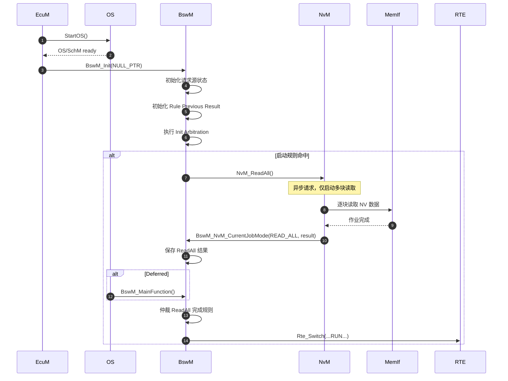
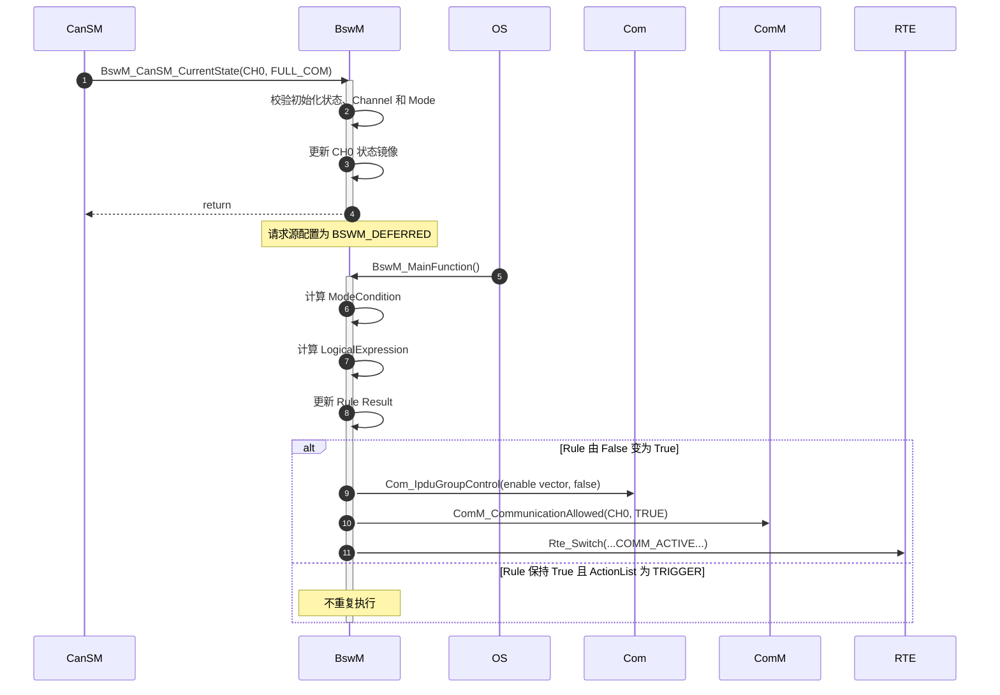
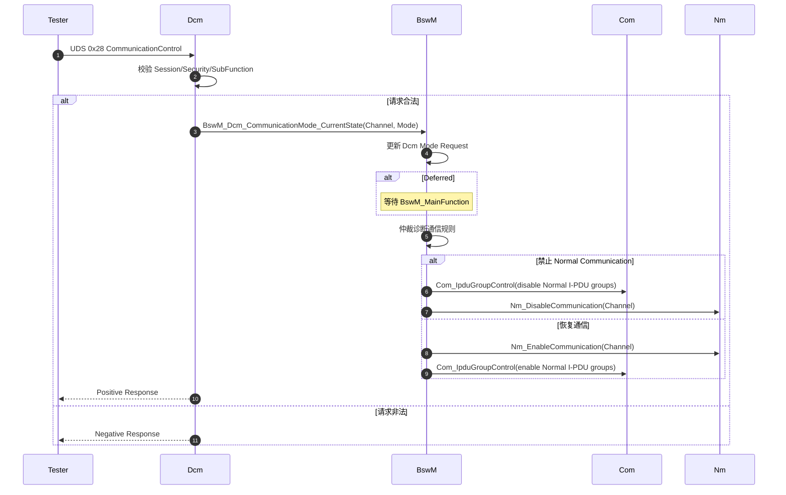
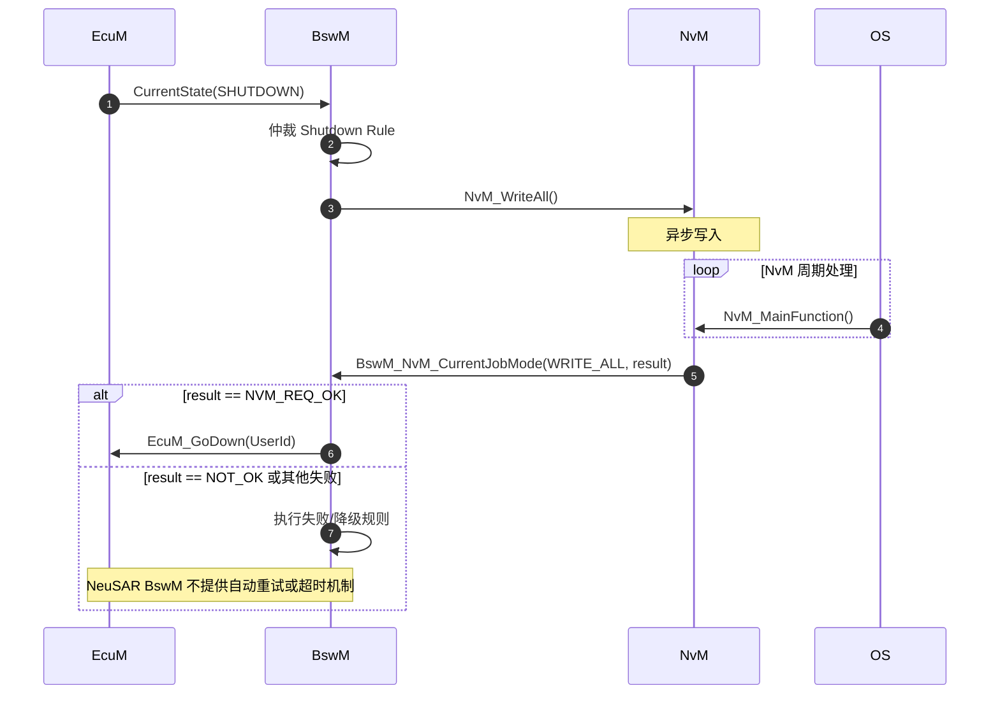

BswM 是 ECU 内部的“模式决策与动作编排器”：它把来自 SWC、[[EcuM]]、[[ComM]]、[[CanSM]]、[[Dcm]]、[[NvM]] 等模块的离散状态或模式请求，转换成规则判断，并按确定顺序调用其他模块的控制接口。它解决的核心痛点不是“保存状态”，而是：
- 避免各 BSW 模块互相直接耦合形成网状依赖
- 把启动、休眠、通信控制、诊断抑制、NvM 存取等系统级策略集中配置
- 将“状态输入 → 条件判断 → 动作序列”固化为可生成、可审查的规则网络

因此，BswM 本质上更接近一个配置驱动的规则引擎和同步动作调度器，而不是拥有固定状态集合的传统有限状态机。

## Mechanism

### 输入侧接口契约

BswM 把所有外部输入统一抽象为 `BswMModeRequestPort`。输入可能是“请求”，也可能只是“当前状态指示”，但进入规则引擎后处理方式相同。

| 上游模块        | 典型输入接口                                                    | BswM 保存的信息                      | 关键契约                                           |
| ----------- | --------------------------------------------------------- | ------------------------------- | ---------------------------------------------- |
| CanSM       | `BswM_CanSM_CurrentState()`                               | 某 CAN Channel 当前模式，如 BUS-OFF    | `NetworkHandle` 必须与 `BswMCanSMChannelRef` 映射一致 |
| ComM        | `BswM_ComM_CurrentMode()`                                 | Channel 的 NO/SILENT/FULL COM 状态 | 通道引用必须与 `ComMChannel` 一致                       |
| EcuM        | `BswM_EcuM_CurrentState()`、`BswM_EcuM_CurrentWakeup()`    | ECU 状态及唤醒源状态                    | 必须在 BswM 初始化后调用                                |
| Dcm         | `BswM_Dcm_CommunicationMode_CurrentState()`               | UDS 0x28 导出的通信控制模式              | BswM 只负责执行通信控制，诊断合法性仍由 Dcm 判断                  |
| NvM         | `BswM_NvM_CurrentJobMode()`、`BswM_NvM_CurrentBlockMode()` | 多块作业或单块作业结果                     | 这是异步 NvM 作业的完成状态输入，不是实际数据传输                    |
| LinSM/LinTp | `BswM_LinSM_CurrentState()`、`BswM_LinTp_RequestMode()`    | LIN 状态或诊断调度表需求                  | Channel 与 Schedule 引用必须一致                      |
| Sd          | Client/EventGroup/EventHandler 状态通知接口                     | SOME/IP-SD 服务和事件组状态             | HandleId 必须匹配 Sd 配置                            |
| SWC/RTE     | `Rte_Read`、`Rte_Mode` 或通用请求                               | 应用模式输入                          | 依赖 RTE 端口和数据类型映射                               |
| 非标准请求方      | `BswM_RequestMode()`                                      | `requesting_user` 对应的自定义模式      | 请求者 ID 必须匹配 `BswMModeRequesterId`              |

- 上游接口多为同步、可重入的状态通知函数，但“接口同步”不代表系统级动作立即完成
- 对 Deferred 请求，接口通常只更新 BswM 内部镜像，真正仲裁在下一次 `BswM_MainFunction()` 中发生
- 对 Immediate 请求，调用栈可能直接进入规则仲裁和 ActionList，因而接口最坏执行时间取决于整个动作链

### 输出侧接口契约

BswM 不直接操作总线控制器或 NVRAM 硬件，而是通过 Action 调用其他 BSW 模块的高层接口：

|下游模块|典型动作/API|BswM 的责任边界|
|---|---|---|
|Com|`Com_IpduGroupControl()`、`Com_ReceptionDMControl()`|组织 I-PDU Group Vector，控制应用报文和 Deadline Monitoring|
|ComM|`ComM_CommunicationAllowed()`、`ComM_RequestComMode()`|允许通信或请求用户通信模式|
|Nm|`Nm_EnableCommunication()`、`Nm_DisableCommunication()`|控制 NM 报文通信|
|EcuM|`EcuM_SelectShutdownTarget()`、`EcuM_GoDown()`、`EcuM_GoHalt()`/`GoPoll()`|选择并触发关机、复位或睡眠流程|
|NvM|常通过 `BswMUserCallout` 调用 `NvM_ReadAll()`、`NvM_WriteAll()`|只发起异步作业，完成结果由 NvM 再通知回来|
|LinSM|`LinSM_ScheduleRequest()`|请求切换 LIN Schedule|
|Sd|`Sd_ClientServiceSetState()`、`Sd_ServerServiceSetState()` 等|控制服务实例或 EventGroup 状态|
|RTE/SWC|`Rte_Switch_<...>()`|向应用发布模式变化|
|用户代码|`BswMUserCalloutFunction`|扩展标准动作，但返回值在该实现中被忽略|
边界原则：BswM 负责“决定调用什么、以什么顺序调用”，不负责保证被调模块最终成功。

### 内部数据组织

BswM 的配置关系可以抽象为六层：

1. **Mode Request Port**
    - 保存某个外部请求源的最新状态
    - 决定采用 Immediate 还是 Deferred 仲裁
2. **Mode Condition**
    - 将一个请求源与目标值比较
    - NeuSAR 主要支持 `BSWM_EQUALS` 和 `BSWM_EQUALS_NOT`
3. **Logical Expression**
    - 用 `AND`、`OR`、`XOR`、`NAND` 组合多个条件或子表达式
    - 手册明确指出表达式内部的计算顺序未定义，因此不应依赖 C 语言式短路或求值顺序
4. **Rule**
    - 引用一个逻辑表达式
    - 根据 True/False 选择对应 ActionList
    - 保存上次仲裁结果，用于判断是否发生边沿变化
5. **ActionList**
    - 定义有序动作序列
    - `BSWM_CONDITION`：每次规则评估都执行
    - `BSWM_TRIGGER`：仅规则结果变化时执行
6. **Action**
    - 调用标准 BSW API、RTE Switch、用户 Callout，或者引用另一条 Rule

### Interfaces

![[bswm-interfaces.png]]

### Immediate 与 Deferred 任务模型

**Immediate** 在请求方的当前调用上下文中完成“状态更新、规则仲裁和动作执行”。**Deferred** 的输入 API 仅更新状态镜像，规则仲裁和动作执行延迟到下一次 `BswM_MainFunction()`。

#### Immediate

![[bswm-immediate.png]]

#### Deferred

![[bswm-deferred.png]]

## Sequence

### 启动初始化与 NvM ReadAll

架构关注点：
- `NvM_ReadAll()` 返回不代表 RAM Block 已经可用
- 必须以 `BswM_NvM_CurrentJobMode(NVM_READ_ALL, NVM_REQ_OK)` 或项目定义的可接受结果作为启动阶段放行条件
- 若规则仅接受 `NVM_REQ_OK`，则 `NVM_REQ_RESTORED_FROM_ROM` 是否允许进入 RUN 必须由项目策略明确
- 如果 ReadAll 失败后没有 FalseActionList 或故障降级路径，系统可能永远停留在初始化状态

### Deferred 通信状态仲裁

### UDS 0x28 通信控制

禁用通信时通常应考虑：
1. 停止应用报文
2. 再禁止 NM 通信

恢复时可考虑：
1. 恢复 NM
2. 再恢复应用 I-PDU Group

但具体顺序取决于网络管理和诊断响应要求。BswM 不会自动推导安全顺序，ActionList 的配置顺序就是实际调用顺序。

### 下电 WriteAll 与失败处理

BswM 只看见 NvM 报告的状态，不会自动实现：
- WriteAll 超时
- 自动重试次数
- 失败后强制下电
- 失败上报 Dem
- 关键块与非关键块差异化处理

这些需要通过 BswM Timer、OS Alarm、用户 Callout 或专门的 Shutdown Manager 设计。

## Configuration

### BswMRequestProcessing

取值：
- `BSWM_IMMEDIATE`
- `BSWM_DEFERRED`

联动约束：
- Immediate 将整个 ActionList 的 WCET 加到请求方调用上下文
- Deferred 的最大仲裁延迟由 `BswMMainFunctionPeriod` 和 OS Task 抖动决定
- 高频状态输入通常更适合 Deferred，因为多个变化可能在主函数前合并为最新状态
- Immediate 规则中的 Action 不应触发不可控的阻塞操作，也应避免经其他模块回调再次进入 BswM 形成环路

### BswMMainFunctionPeriod

该值必须与调用 `BswM_MainFunction()` 的 OS Task 实际周期一致。

联动约束：
- 决定 Deferred 请求的响应上界
- 决定 BswM Timer 的时间基准和误差
- 决定周期性 ActionList 的执行频率
- 影响主函数单周期 CPU 峰值
- 实际 Task 周期与配置值不一致时，Timer 会快走或慢走

### BswMActionListExecution

取值：
- `BSWM_CONDITION`
- `BSWM_TRIGGER`

联动约束：
- `CONDITION` 要求列表中所有动作可重复执行，或下游 API 明确支持重复请求
- `TRIGGER` 与 `BswMRuleInitState` 联合决定第一次仲裁是否执行
- 对 NvM ReadAll/WriteAll、EcuM GoDown、一次性 RTE Start 等动作，应特别警惕 `CONDITION` 导致周期重复调用

推荐经验：

|动作类型|推荐策略|
|---|---|
|设置型、幂等型动作|可考虑 `CONDITION`|
|启动作业、切换状态、一次性通知|优先 `TRIGGER`|
|明确要求持续刷新|`CONDITION`，但必须核算周期调用成本|
