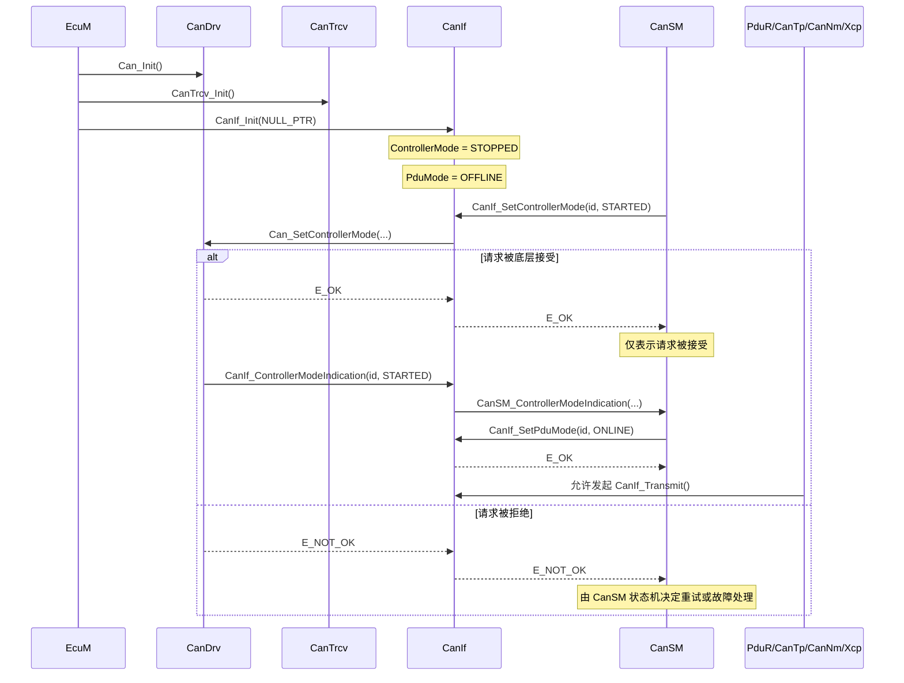
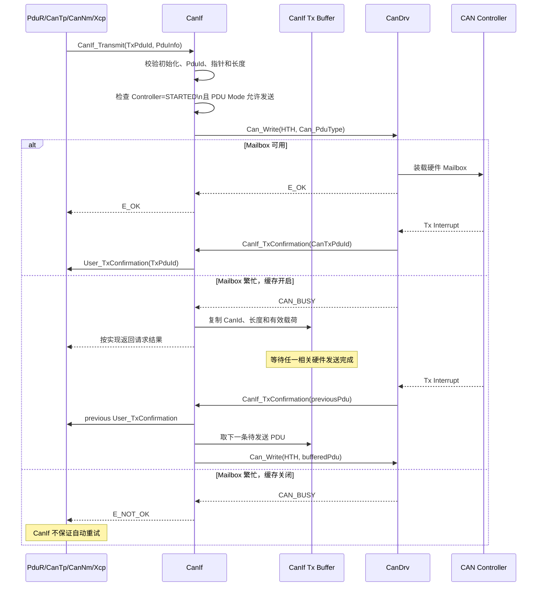
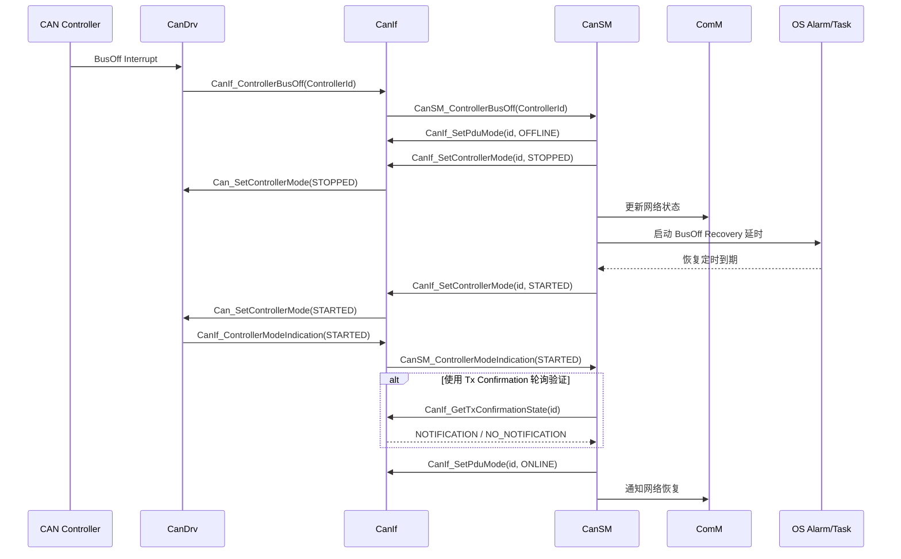

CanIf 是 CAN 通信栈的软件适配与访问控制层。它解决两个核心问题：
- 向上屏蔽 CAN Controller、Hardware Object、CanDrv 厂商实现和 CanTrcv 的差异，为 [[PduR]]、[[CanTp]]、[[CanNm]]、[[Xcp]]、[[CanSM]] 等模块提供统一接口
- 向下完成抽象 PDU 到具体 CAN Controller、HTH/HRH、CanId 和回调目标的静态映射，并通过 Controller Mode 与 PDU Mode 控制通信是否允许执行

CanIf 不是协议处理模块。它不解析 COM Signal，不执行 ISO-TP 分段重组，也不负责 BusOff 恢复策略。它只负责把上层 I-PDU 映射为 CAN L-PDU、把底层接收帧识别为 Rx PDU，并转发模式、收发和异常事件。

## Mechanism

### 接口契约

上游调用者对 CanIf 的契约

| 上游模块                     | 调用或接收的接口                                      | 核心契约                                                                                 |
| ------------------------ | --------------------------------------------- | ------------------------------------------------------------------------------------ |
| PduR、CanTp、CanNm、Xcp、CDD | `CanIf_Transmit()`                            | 必须使用配置生成的 `CanIfTxSduId`；传入数据指针有效；长度满足对应帧类型；Controller 必须为 `STARTED`，PDU Mode 必须允许发送 |
| PduR、CanTp、CanNm、Xcp、CDD | `User_TxConfirmation()`、`User_RxIndication()` | 回调目标由每个 Tx/Rx PDU 的 UL 配置决定，PDU 引用和软件 PduId 必须与上层路由完全一致                              |
| CanSM                    | `CanIf_SetControllerMode()`                   | 该接口是异步请求接受接口，`E_OK` 只代表底层接受请求，不代表控制器已经完成切换                                           |
| CanSM                    | `CanIf_SetPduMode()`                          | 同步修改 CanIf 的软件收发门控，不等价于切换 CAN Controller 的硬件状态                                       |
| CanSM                    | `CanIf_SetTrcvMode()` 等                       | 依赖下层 CanTrcv 配置及硬件能力                                                                 |
| EcuM/初始化序列               | `CanIf_Init(NULL_PTR)`                        | 必须在 CanDrv 和 CanTrcv 初始化之后调用；该实现不支持 Post-Build，因此配置指针传 `NULL_PTR`                    |

CanIf 对下游模块的契约

|下游模块|CanIf 使用的能力|核心契约|
|---|---|---|
|CanDrv|`Can_Write()`、Controller Mode 控制及其回调|HTH、ControllerId、软件 PduId 必须与 Can 配置一致；发送完成通过 `CanIf_TxConfirmation()` 回来|
|CanDrv|`CanIf_RxIndication()`|当前实现只支持中断方式接收，不提供轮询读取 Rx PDU 的完整路径|
|CanDrv|`CanIf_ControllerBusOff()`|CanIf 只转发 BusOff，真正的恢复状态机由 CanSM 管理|
|CanTrcv|模式、唤醒标志、PN 能力接口|仅当配置 CanIfTrcvCfg 且硬件驱动实际支持时有效|
|Det|Development Error 上报|受 `CanIfPublicDevErrorDetect` 控制，但部分丢帧场景不会报告 DET|

### 边界

CanIf 负责：
- Tx PDU 到 CanId、HTH、Controller 和上层确认函数的映射
- Rx HRH、CanId、DLC 到 Rx PDU 和上层接收函数的映射
- Controller Mode、PDU Mode、Transceiver Mode 的接口适配
- `CAN_BUSY` 时的可选软件发送缓存
- BusOff、模式变化、唤醒相关事件的回调转发
- CAN FD 帧类型及最大 64 字节 DLC 的配置支持

CanIf 不负责：
- I-PDU 路由，属于 PduR
- 信号打包与发送模式，属于 Com
- 长报文分段重组，属于 CanTp
- BusOff 恢复策略和定时，属于 CanSM
- 硬件 Mailbox 调度和中断处理，属于 CanDrv
- 应用层重发、端到端确认和业务超时

### 发送缓存机制

当 `CanIfPublicTxBuffering = true` 时：
1. CanIf 先调用 `Can_Write()`
2. 如果底层接受，则等待 `CanIf_TxConfirmation()`
3. 如果底层返回 `CAN_BUSY`，则复制 PDU 到与 HTH 关联的 CanIf 软件缓存
4. 某个硬件报文发送完成后，CanDrv 调用 `CanIf_TxConfirmation()`
5. CanIf 在完成上层确认的同时，尝试从缓存取出下一条报文再次调用 `Can_Write()`

## Sequence

### ECU 初始化并上线通信

CanIf 初始化本身是同步的，但控制器启停是异步的。正确上线过程不是简单地调用一次 `CanIf_Init()`，而是：
1. 初始化 CanDrv 和 CanTrcv
2. 调用 `CanIf_Init(NULL_PTR)`
3. 由 CanSM 请求 Controller 进入 `STARTED`
4. 等待 CanDrv 的 Controller Mode Indication
5. CanSM 再将 PDU Mode 设置为 `ONLINE`
6. 此后上层发送才可被接受

### 正常发送与 CAN_BUSY 缓存重试

- `CanIf_Transmit()` 是同步 API，但只同步返回“请求是否被接受”，而不是“总线发送已经完成”
- 真实发送完成以 `CanIf_TxConfirmation()` 为准
- 如果开启缓存，调用返回语义需要结合实现代码确认

### BusOff 异常与恢复

BusOff 恢复策略属于 [[CanSM]]，不属于 CanIf。CanIf 的职责是把底层控制器事件转换为 CanSM 可识别的通知，并在恢复过程中执行模式和 PDU 门控调用。

