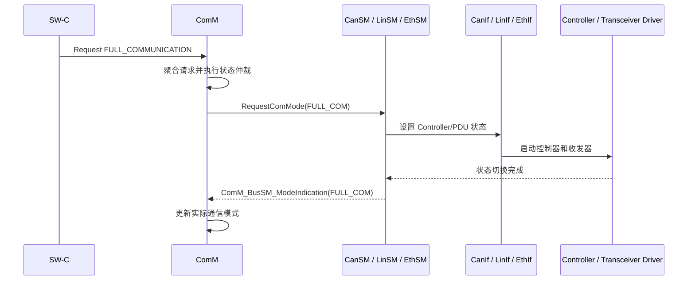

ComM 是通信需求的聚合器和通信模式的决策器，但不是总线状态的实际执行者。

上层 SW-C、[[Dcm]]、[[EcuM]] 等只需表达“需要通信”或“释放通信”，ComM 将这些请求按 User、Channel 和 PNC 聚合，再结合通信许可、模式限制、网络管理类型等条件，决定目标通信模式，并委托 BusSM[^1]、Nm 执行实际开网、关网和休眠流程。

[^1]: 它不是一个独立、统一的 AUTOSAR 模块名，是 CanSM/LinSM/EthSM 的统称

ComM 对外抽象三种通信模式：
- `COMM_NO_COMMUNICATION`：不能发送，也不能接收
- `COMM_SILENT_COMMUNICATION`：只能接收，不能发送。它是内部关闭过程中的过渡模式，User 不可直接请求
- `COMM_FULL_COMMUNICATION`：允许发送和接收

## 核心边界

ComM 不负责：
- CAN、LIN、Ethernet 控制器和收发器的具体启动、停止
- NM 报文发送、Repeat Message、Prepare Bus Sleep 等协议行为
- 应用报文的调度和发送
- 系统唤醒源的物理检测与验证
- 调用 API 后立即完成整个总线开关过程

因此应区分三个概念：
1. **User Requested Mode**：User 希望获得的模式
2. **ComM Channel State**：ComM 内部状态机当前状态
3. **Actual Bus Mode**：BusSM 实际达到的通信模式

三者在状态切换期间可能不一致。`ComM_RequestComMode()` 返回 `E_OK`，主要表示请求被 ComM 接受，不应简单理解为 BusSM 已经完成物理开网。实际模式由 BusSM 后续通过 `ComM_BusSM_ModeIndication()` 异步反馈。

### ComM 和 BusSM 的关系

两者之间是典型的请求与确认关系：



ComM 向 BusSM 发出请求后，不应立即假设总线已经完成切换，而要等待 BusSM 的模式指示。

## State Machine

![[comm-state-machine.png]]

## Sequence

### Active Startup

Active Startup 是“我有本地通信需求，所以主动请求并维持网络”；Passive Startup 是“网络已经被别人唤醒，我只恢复到可参与通信的状态，但不主动声明必须维持网络”。

![[comm-active-startup.png]]

### Passive Start Up

![[comm-passive-startup.png]]

### Network Shutdown

ComM 在最后一个通信请求释放后，先让 [[Nm]] 协调整个网络睡眠，再通过 [[CanSM]] 分阶段关闭本 ECU 的发送能力和 CAN 硬件。

```text
最后一个 FullCom 请求被释放
        ↓
ComM 判断已经没有 User/DCM 请求
        ↓
FULL_COM_NETWORK_REQUESTED
        ↓
FULL_COM_READY_SLEEP
        ↓
ComM → Nm_NetworkRelease()
        ↓
Nm 协调网络进入 Prepare Bus Sleep
        ↓
ComM → SILENT_COMMUNICATION
        ↓
ComM → CanSM_RequestComMode(SILENT_COM)
        ↓
Nm 确认进入 Bus Sleep
        ↓
ComM → NO_COMMUNICATION
        ↓
ComM → CanSM_RequestComMode(NO_COM)
        ↓
CanSM 异步完成硬件关闭并反馈实际模式
```

![[comm-network-shutdown.png]]