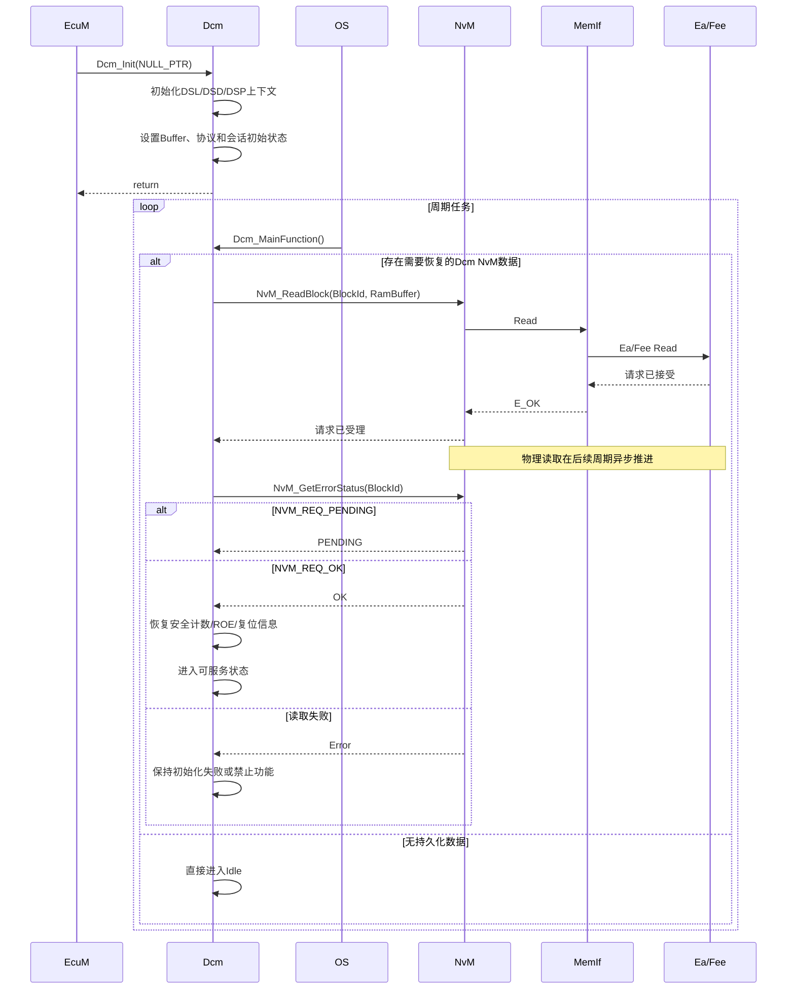
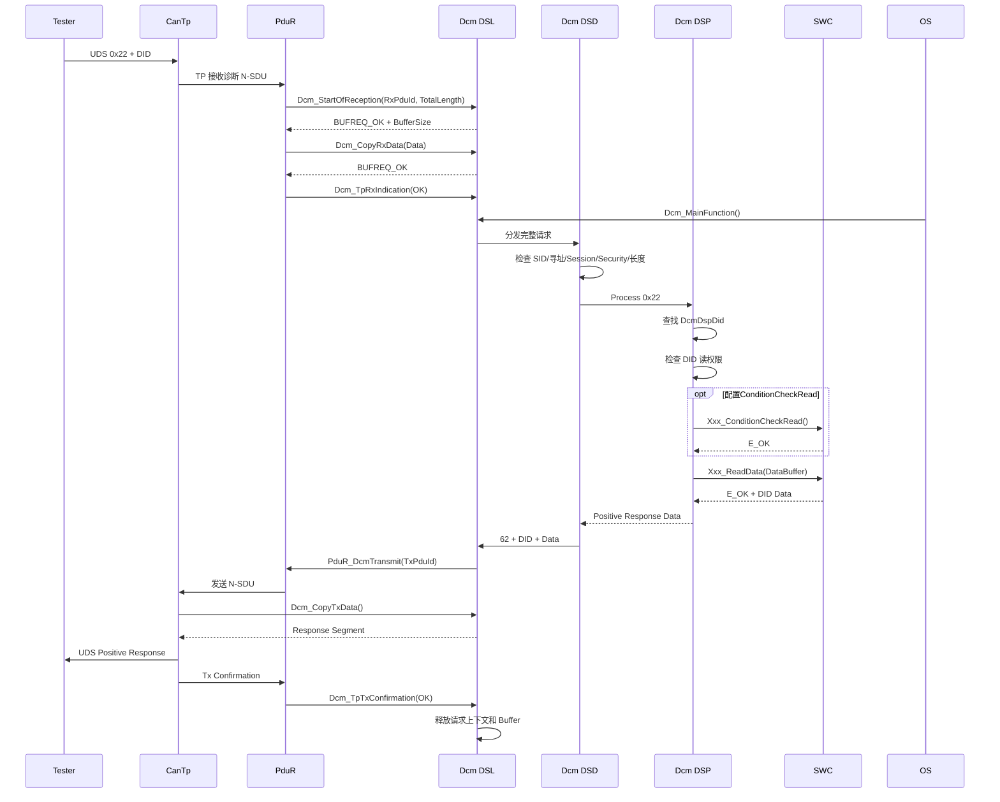
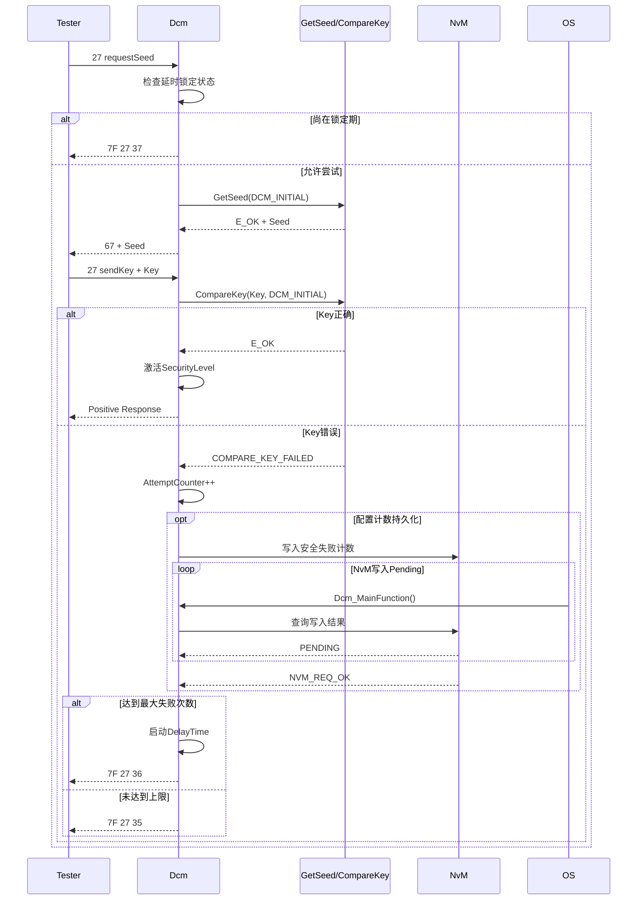

Dcm 是 AUTOSAR Classic 中诊断通信的协议控制与服务编排中心：
- 向下承接 [[PduR]] 和 TP 层传入的完整 UDS/OBD 请求
- 在内部完成连接管理、会话和安全校验、服务分发与异步任务调度
- 向上调用 SWC、Dem、NvM、BswM、Csm、KeyM 等模块完成具体业务
- 最后组织肯定响应或否定响应，并通过 PduR 返回诊断仪

Dcm 不负责 CAN 分帧重组、不直接操作 CAN 控制器，也通常不持有具体业务数据。它处理的是完整诊断消息及其执行上下文，而底层 TP 负责 N-PDU 分段与重组，应用或其他 BSW 模块负责数据、故障、存储和硬件操作。

![[dcm-overview.png]]

## Mechanism

### 内部分层

Dcm 内部可理解为三个层次：

```text
DSL：连接、协议、缓冲区、收发、定时器、会话上下文
 ↓
DSD：识别 SID、验证权限、分发服务、组织最终响应
 ↓
DSP：执行具体 UDS/OBD 服务，调用 SWC 或其他 BSW
```

从实现角度，Dcm 不是简单的“收到报文后调用一个函数”，而是一个以 `Dcm_MainFunction` 为节拍的事务执行器。

### 上层业务契约

对于 DID、RID 和安全访问，Dcm 通过生成回调或 RTE Mapping 调用应用：
- DID: `ReadData`, `WriteData`, `ConditionCheckRead`
- RID: `Start`, `Stop`, `RequestResult`
- Security: `GetSeed`, `CompareKey`
- Mode Switch: Session, ECU Reset, Communication Control

同步接口必须一次返回最终结果；异步接口第一次以 `DCM_INITIAL` 调用，返回 `DCM_E_PENDING` 后，Dcm 在后续 `Dcm_MainFunction` 中以 `DCM_PENDING` 再次调用。

### 下层输入契约

TP 通过以下回调把一个完整诊断 N-SDU 逐步交给 Dcm：
1. `Dcm_StartOfReception`
    - 告知总长度
    - Dcm 检查初始化状态、PduId、Buffer 容量和忙闲状态
2. `Dcm_CopyRxData`
    - 分段把数据复制进 DSL Buffer
3. `Dcm_TpRxIndication`
    - 通知完整 N-SDU 接收成功或失败

接收完成前，Dcm 只是在填充缓冲区；只有收到成功的 `Dcm_TpRxIndication` 后，才可以开始处理请求。

### 下层输出契约

Dcm 组织响应后，通过 PduR 发起传输，TP 随后调用：
- `Dcm_CopyTxData`：从 Dcm Tx Buffer 获取待发数据
- `Dcm_TpTxConfirmation`：通知最终发送成功或失败

发送确认是请求生命周期的最后阶段。部分服务的后处理动作，例如复位、模式切换或资源释放，必须以 Tx Confirmation 为边界，不能把“调用 PduR 成功”等同于“响应已经在线发送完成”。

### 横向模块依赖

- **EcuM**：启动期间调用 `Dcm_Init`
- **OS/SchM**：周期调度 `Dcm_MainFunction`
- **PduR/TP**：诊断 N-SDU 接收和响应发送
- **ComM**：诊断激活时保持网络通信
- **Dem**：DTC 读取、清除和 DTC Setting
- **NvM**：保存复位信息、安全失败计数、DID 或 ROE 状态
- **BswM**：执行 `0x28` 通信控制
- **RTE/SWC**：DID、Routine、模式切换和应用逻辑
- **Det**：报告未初始化、空指针、参数和缓冲区越界等开发错误
- **Csm/KeyM**：支持 `0x29` 认证服务

## Sequence

### 初始化及 NvM 数据恢复

Dcm 的基础初始化通过 `Dcm_Init` 完成，通常由 EcuM 在 ECU 启动过程中调用；周期功能则依赖 OS Task 调用 `Dcm_MainFunction`。如果 Dcm 配置了需要从 NvM 恢复的数据，例如安全失败计数、复位后响应信息或持久化 ROE 状态，Dcm 会在后续周期中读取对应 NvM Block。



### 普通同步 DID 读取



- `Dcm_CopyRxData` 只做数据搬运，不执行 0x22
- DSD 处理通用权限，DSP 处理 DID 特有权限与数据访问
- `ConditionCheckRead` 与 `ReadData` 是两个不同阶段
- 肯定响应 SID 为请求 SID 加 `0x40`
- 请求真正结束于 `Dcm_TpTxConfirmation`

### SecurityAccess 失败

每个安全等级有独立失败计数。密钥比较失败或重复请求同一安全等级 Seed 时，失败计数可能增加；达到 `DcmDspSecurityNumAttDelay` 后，进入由 `DcmDspSecurityDelayTime` 定义的锁定期。失败计数可通过 `DcmDspSecurityBlockIdRef` 持久化到 NvM。

