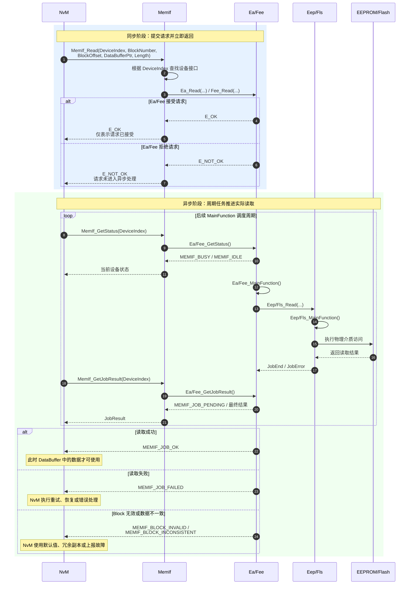

MemIf 位于 [[NvM]] 与 [[Ea]]/[[Fee]] 之间，通过统一 API 加 DeviceIndex 将 NvM 的存储请求路由到不同类型的非易失存储抽象模块，从而隔离 NvM 与具体 EEPROM/Flash 实现。它解决的主要问题不是存储算法，而是：
- 让 NvM 不必分别依赖 Ea API 和 Fee API
- 通过设备索引统一访问 EEPROM 与 Flash EEPROM Emulation
- 将设备差异限制在配置生成的函数接口表中
- 降低 NvM 对底层介质类型、驱动接口和工程变体的耦合

> MemIf 更接近一个“静态多态分发器”，而不是一个真正的存储管理器。它不维护 NV Block，不执行磨损均衡，不计算 CRC，也不负责请求排队。

## Mechanism

### 上下游接口契约

#### 上游：NvM

NvM 负责：
- 根据 `NvMBlockDescriptor` 确定目标 NV Block
- 根据 `NvMNvramDeviceId` 选择目标设备
- 提供 `BlockNumber`、偏移、长度和 RAM Buffer
- 发起读、写、失效、擦除和取消请求
- 在后续调度周期中查询设备状态与 JobResult
- 根据 `MEMIF_JOB_OK`、`MEMIF_JOB_FAILED`、`MEMIF_BLOCK_INVALID` 等结果推进 NvM 自己的 Block 状态机

MemIf 对 NvM 提供的统一接口包括：
- `MemIf_SetMode`
- `MemIf_Read`
- `MemIf_Write`
- `MemIf_Cancel`
- `MemIf_GetStatus`
- `MemIf_GetJobResult`
- `MemIf_InvalidateBlock`
- `MemIf_EraseImmediateBlock`
- 可选的 `MemIf_GetVersionInfo`

#### 下游：Ea/Fee

MemIf 根据 `DeviceIndex`：
1. 校验设备索引是否越界
2. 从配置生成的接口列表中找到对应设备
3. 调用该设备的 Ea/Fee 等价 API
4. 将下层返回值或状态原样返回给 NvM

下层 Ea/Fee 负责：
- Block 地址解释与介质映射
- 请求接收、排队和实际执行
- 维护 `IDLE / BUSY / BUSY_INTERNAL` 状态
- 维护 JobResult
- 最终访问 Eep/Fls 驱动
- 根据自身算法完成冗余、失效标记、擦除或 Flash 仿 EEPROM 管理

### 核心机制与状态机

MemIf API 中同时出现两个关键标识：
- `DeviceIndex`：决定请求发给哪个 Ea/Fee 实例
- `BlockNumber`：由目标 Ea/Fee 解释，用于定位下层存储 Block

### 「同步 API」与「异步作业」

同步的是请求提交函数本身，不是 NV 操作的完成过程。



## Configuration

### MemIfNumberOfDevices

配置下层 Ea/Fee 设备数量，范围为 `1..2`，属于必配项且不支持 Post-build。

联动规则：
- 仅使用 Ea 或仅使用 Fee：配置为 `1`
- 同时使用 Ea 和 Fee：配置为 `2`
- 若所有 `NvMNvramDeviceId` 都是同一个值，设备数应为 `1`
- 若 `NvMNvramDeviceId` 同时包含 `0` 和 `1`，设备数应为 `2`

### NvMNvramDeviceId

它属于 NvM Block 配置，不是 MemIf 参数，但却是影响 MemIf 路由最关键的上游配置。

```text
NvMBlockDescriptor.NvMNvramDeviceId
  → MemIf API 的 DeviceIndex
  → MemIf_Lcfg.c 中的设备接口条目
  → Ea 或 Fee
```

典型错误：
- Block 应位于 Fee，却配置到 Ea 的 DeviceIndex
- MemIf 配置为单设备，但 NvM 中仍存在 DeviceId 1
- 多 ECU 变体中设备表顺序不一致
- 合并 ARXML 后 DeviceId 数值变化，但 MemIf 生成配置没有同步更新

