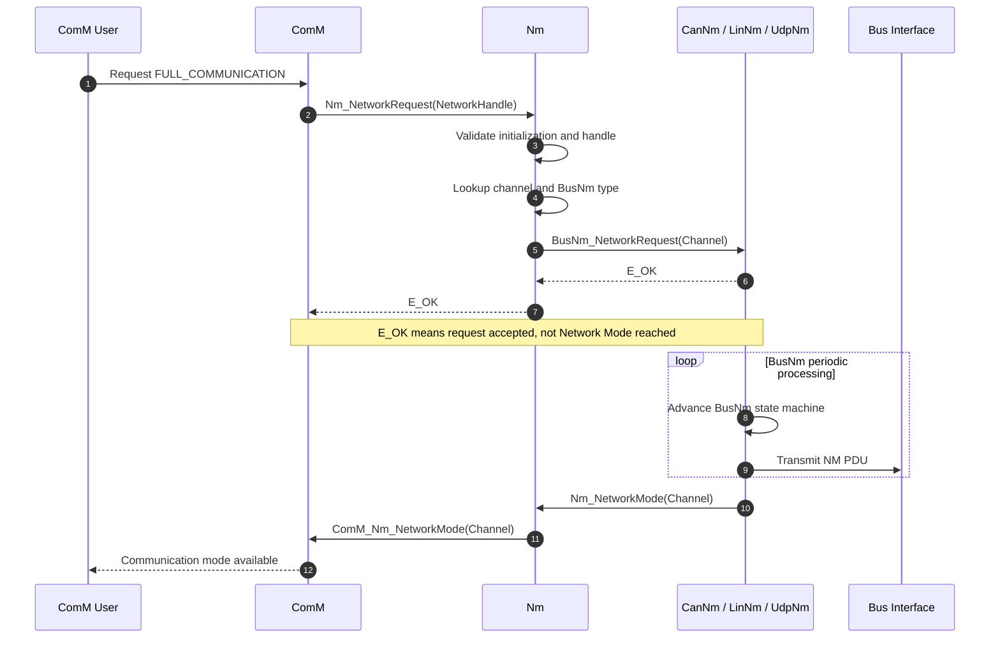

Nm 是 [[ComM]] 与各类 BusNm 之间的统一网络管理接口层，同时可作为多通道网络休眠协调器。它解决两个核心问题：
- 屏蔽总线差异：ComM 不需要分别理解 [[CanNm]]、[[LinNm]]、UdpNm 或 GenericNm 的接口
- 协调多网络休眠：网关 ECU 同时挂接多条总线时，Nm 确保各通道满足条件后，以协调方式进入 Bus-Sleep Mode

NM PDU 的发送周期、超时检测、Repeat Message、Ready Sleep、Prepare Bus Sleep 等具体协议行为仍由 CanNm、LinNm、UdpNm 等 BusNm 实现。Nm 主要负责：
- 根据 Channel 找到对应 BusNm；
- 转发 ComM 请求；
- 将 BusNm 状态回调统一转发给 ComM；
- 在启用 Coordinator 时维护跨通道协调状态和定时器。

![[nm-stack.png]]

## Mechanism

### 上下游接口

ComM 使用统一的 `NetworkHandleType` 请求网络启动、保持或释放，Nm 再根据通道配置将请求分派给对应 BusNm：
- `NetworkHandle` 是 ComM/Nm 语义下的逻辑通道句柄，必须能够映射到一个 `NmChannelConfig`
- 同一通道上的异步控制 API 通常不可重入，不同通道之间可以并行调用
- `E_OK` 只表示 BusNm 接受了请求，不代表网络已经完成唤醒或休眠
- 最终状态通过 `Nm_NetworkMode`、`Nm_PrepareBusSleepMode`、`Nm_BusSleepMode` 等回调反馈

Nm 不直接控制 CAN、LIN 或 Ethernet 控制器，而是调用 BusNm 的标准接口。

BusNm 通过 Nm 的统一回调上报状态。

### 主动网络请求与异步状态反馈

当 ComM 需要通信时，调用 `Nm_NetworkRequest()`。Nm 根据通道的总线类型调用对应 `BusNm_NetworkRequest()`。返回 `E_OK` 后，BusNm 在后续周期中推动自身状态机，进入 Network Mode 后再回调 Nm。

主动启动与被动启动的区别
- `Nm_NetworkRequest()`：本地有通信需求，主动请求网络并保持网络唤醒
- `Nm_PassiveStartUp()`：本地检测到远程网络活动，希望跟随网络启动，但不等价于建立长期本地网络需求

### Nm Coordinator

Nm 先收集所有关联网络已具备休眠条件的证据，再根据不同 BusNm 的关网耗时启动不同的 Shutdown Timer，最终让 FlexRay 和 CAN 尽量在同一目标时间完成休眠。

![[nm-coordination.png]]