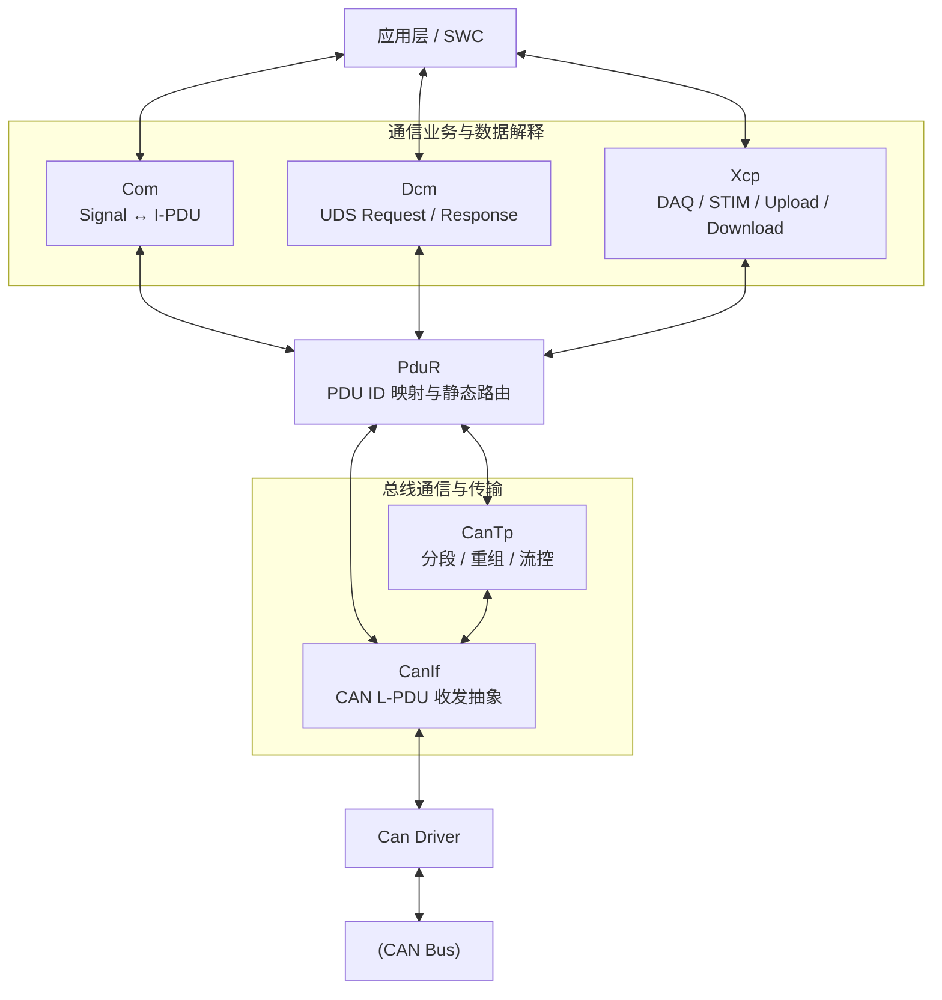

PduR 是 AUTOSAR 通信栈中的 I-PDU 静态路由器。它解决的核心问题是：将不同上层通信用户与不同下层通信协议解耦，并依据生成期配置完成 PDU[^1] ID 映射、单播、多播、网关转发和跨 Partition 分发。

[^1]: Protocol Data Unit

PduR 的路由决策仅依赖 静态配置的 PDU ID 和路由表。它不解析信号、不修改 Payload、不计算校验和，也不根据数据内容动态选择路由。换句话说，PduR 关注的是“这份 I-PDU 应送往哪里”，而不是“这份 I-PDU 表达了什么”。

## Mechanism

### PduR 通信链路

在 AUTOSAR 通信栈中，可以把各模块理解成三个层次：



PduR 本身不理解 Signal、UDS Service 或 XCP Command，它看到的是：

```text
PDU ID + 数据指针 + 数据长度
```

#### 普通 CAN 信号

[[Com]] 管理 Signal 到 I-PDU 的映射，[[CanIf]] 管理完整 CAN 帧的收发，PduR 负责把两者连接起来。

#### UDS Request over CAN

PduR 对 UDS 的 SID、DID、SubFunction 一无所知。它只是把 CanTp 提供的数据通过 TP API 转交给 Dcm。对于 TP 接收，首帧或单帧触发 `StartOfReception`，后续数据通过 `CopyRxData` 提供，最终通过 `TpRxIndication` 通知完整 I-PDU 是否接收成功。

需要强调，即使某条 UDS Request 很短、可以用 Single Frame 发送，它通常仍然经过 CanTp，因为 SF 也是 ISO-TP 的一种帧类型。

#### UDS Response

典型 TP 发送采用“目标 TP 主动取数”模型：
1. Dcm 发起 `Transmit`
2. PduR 将发送请求路由给 CanTp
3. CanTp 根据当前要发送的 SF、FF 或 CF 大小调用 `CopyTxData()`
4. PduR 再向 Dcm 获取对应长度的数据
5. 全部发送结束后，通过 `TpTxConfirmation()` 通知最终结果

#### IF 与 TP 的对比

|维度|IF|TP|
|---|---|---|
|数据提供方式|通常一次提供完整 PDU|多次复制分段数据|
|CAN 侧表现|通常一个 CAN/CAN FD Frame|一个或多个 ISO-TP Frame|
|接收入口|`RxIndication`|`StartOfReception`|
|后续接收|无|`CopyRxData`|
|发送取数|直接数据或 `TriggerTransmit`|`CopyTxData`|
|接收结束|`RxIndication` 本身即表示收到|`TpRxIndication`|
|发送结束|`TxConfirmation`|`TpTxConfirmation`|
|流控|无|FC、BS、STmin|
|典型上层|Com、Xcp|Dcm|
|典型下层|CanIf|CanTp|

#### Confirmation 和 Indication

Indication：下层告诉上层，“我收到东西了”
Confirmation：下层告诉上层，“你让我发的东西完成了”
