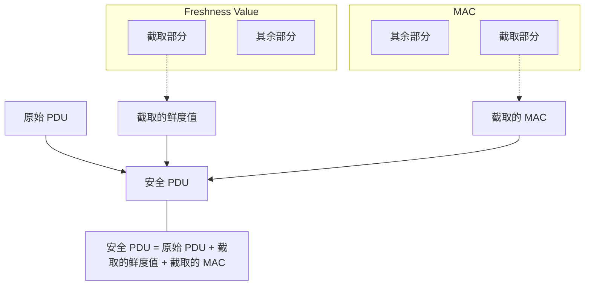

SecOC 位于 [[PduR]] 路由链路中间，对待发送的 Authentic I-PDU 增加 Freshness Value 和 MAC[^1]，对接收到的 Secured I-PDU 执行重放检查与 MAC 验证，从而保证报文来源真实性、数据完整性和时效性。

[^1]: Message Authentication Code

SecOC 不负责加密 Payload，也不负责网络发送。它保护的是报文的真实性和完整性，而不是机密性。

## Mechanism

### 解决的核心问题

普通通信链路只能说明“收到了一帧数据”，不能证明：
- 数据是不是由预期 ECU 发送
- Payload 在传输过程中是否被篡改
- 当前报文是不是攻击者重放的历史有效报文
- 同一个合法报文是否被重复注入网络

SecOC 通过两个维度解决这些问题：

1. **MAC**
    - 绑定 `DataId + Payload + Full Freshness Value`
    - 防止 Payload 被篡改
    - 防止一个 PDU 的合法 MAC 被挪用到另一个 PDU
2. **Freshness Value**
    - 典型实现为计数器、时间值或复合新鲜度
    - 防止历史合法报文被重新发送
    - 网络上传输的通常只是 Freshness Value 的截断部分，接收端由 FvM 重建完整值

### Freshness 是什么

很多人第一次学 SecOC 时以为有 MAC 就够了，但攻击者会抓一次合法报文（MAC  仍然正确）做重放攻击。



### SecOC 和 CSM 的关系

SecOC 自己不会算 MAC，它调用 CSM 完成加密计算。

### 内部任务模型

SecOC 的核心不是“调用一个加密函数”，而是两条相互独立的周期处理管线。

#### Tx 管线

```text
SecOC_IfTransmit
    -> 缓存 Authentic I-PDU
    -> 标记 Tx Job Pending
    -> SecOC_MainFunctionTx
        -> 获取完整/截断 FV
        -> 构造 MAC 输入
        -> 调用 Csm 生成 MAC
        -> 截断 MAC
        -> 构造 Secured I-PDU
        -> 通过 PduR 向下发送
        -> 可选通知 FvM 已启动发送
```

#### Rx 管线

```text
SecOC_RxIndication
    -> 缓存 Secured I-PDU
    -> 标记 Rx Job Pending
    -> SecOC_MainFunctionRx
        -> 拆分 Payload、Truncated FV、Truncated MAC
        -> 获取/重建 Full FV
        -> 构造验证输入
        -> 调用 Csm 验证 MAC
        -> 根据验证结果转发或丢弃
        -> 更新 FvM / Dem 状态
```

## Sequence

![[secoc-receive-secured-ipdu.png]]

`SecOC_RxIndication()` 只负责接收和缓存安全报文，真正的 Freshness 重建与 MAC 验证由后续 `SecOC_MainFunctionRx()` 推进；当 FreshnessManager 或 Csm 返回 `E_BUSY` 时，SecOC 会按照配置的尝试次数重新执行验证流程。

![[secoc-transmit.png]]

![[secoc-triggertransmit.png]]

![[secoc-transmit-tp.png]]

![[secoc-receive.png]]

![[secoc-receive-tp.png]]
