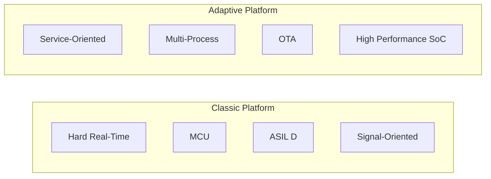
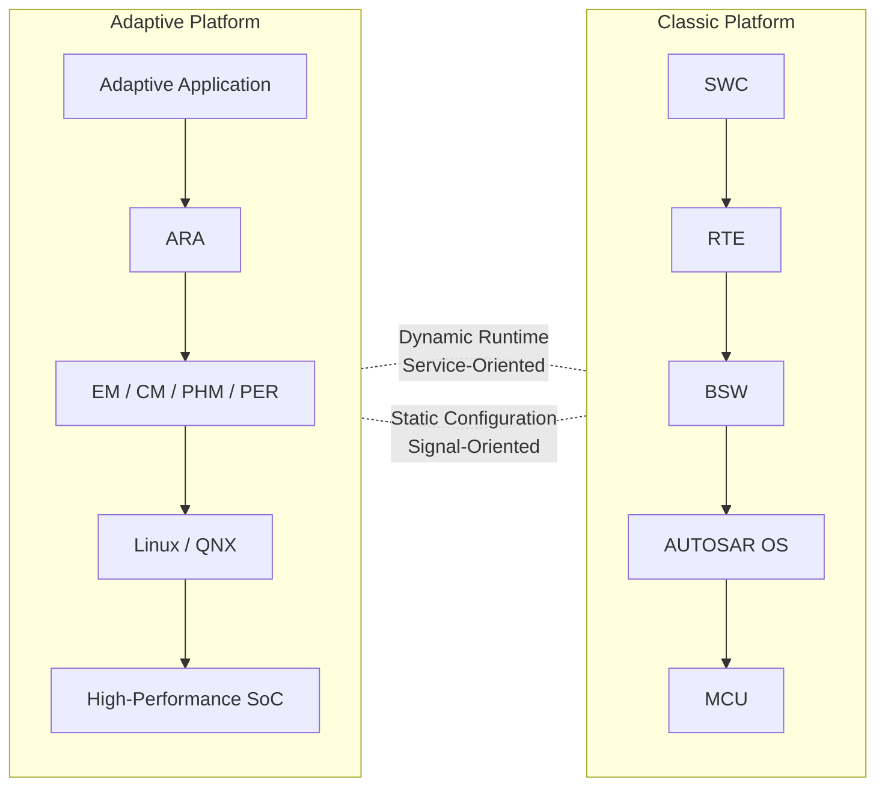
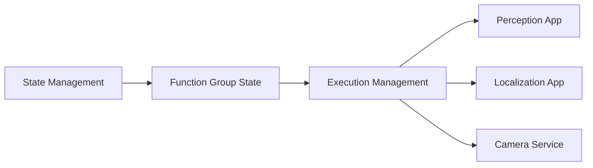
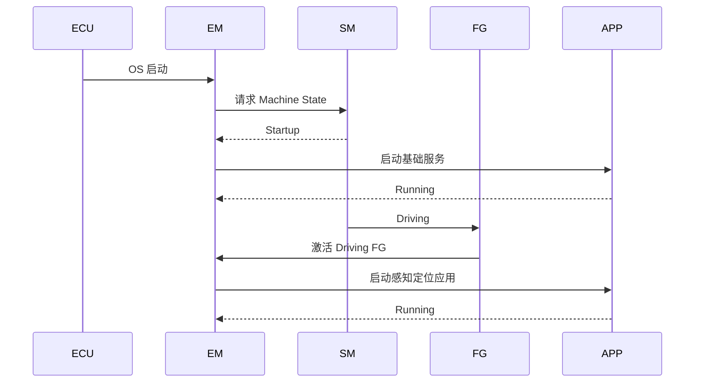
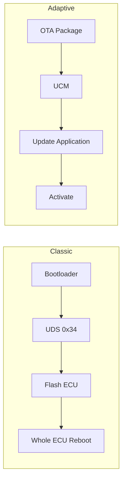
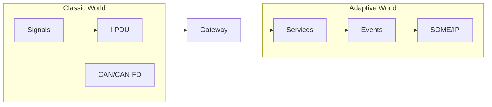
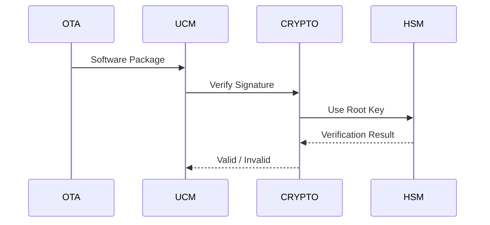
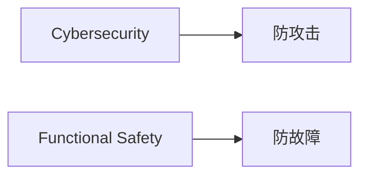
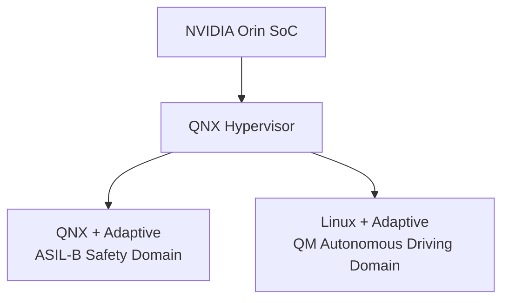
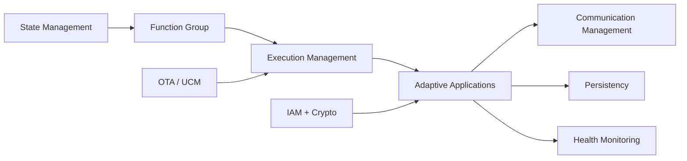

2017 年，AUTOSAR 推出 Adaptive Platform，以应对自动驾驶、智能座舱和 OTA 等场景对高性能计算平台的需求。相比面向 MCU、强调静态配置的 Classic Platform，Adaptive 运行于 Linux、QNX 等 POSIX 系统之上，支持现代 C++、多进程架构、服务化通信以及应用的动态部署与更新。

Adaptive 与 Classic 并非替代关系，而是分工协作：Classic 负责安全关键实时控制，Adaptive 负责感知、融合、座舱和云连接等高算力应用，两者通常通过 SOME/IP 等机制协同工作。

Adaptive 最大的特点是运行时动态性。服务可以被动态发现，应用可以独立部署和升级，进程异常后需要自动恢复。因此，平台引入了 Execution Management（EM）、Service Discovery（SD）和 Platform Health Management（PHM）等运行时管理机制。理解这些机制，是掌握 Adaptive Platform 的关键。

## CP 与 AP 的平台差异

两代平台的差异是根本性的：
- 在 CP 中，任务、通信关系和资源分配都在集成阶段确定；系统启动后基本保持不变，强调可预测性和实时性。
- 在 AP 中，服务可以动态注册与发现，应用可以独立安装、升级或卸载，进程之间相互隔离，更接近现代服务器或云原生软件架构。



| 维度   | Classic                 | Adaptive             |
| ---- | ----------------------- | -------------------- |
| 目标硬件 | MCU（AURIX、S32K 等）       | 高性能 SoC（Orin、8295 等） |
| 操作系统 | AUTOSAR OS（OSEK/VDX）    | Linux、QNX 等 POSIX 系统 |
| 主要语言 | C（MISRA C）              | Modern C++（C++14/17） |
| 内存模型 | 静态分配                    | 动态分配（受控）             |
| 执行模型 | Task + Runnable         | Process + Thread     |
| 通信方式 | Signal（Sender-Receiver） | Service（SOA、SOME/IP） |
| 软件集成 | 编译期静态集成                 | 运行时动态部署              |
| 软件更新 | 整 ECU 刷写                | 应用级 OTA              |
| 设计目标 | 确定性与功能安全                | 灵活性与可扩展性             |

Adaptive 引入的关键能力：**动态部署**（应用可作为独立包安装/卸载）、**服务发现**（运行时找到服务提供者）、**进程隔离**（一个应用崩溃不影响其他）、**OTA 友好**（应用级更新）。

## Adaptive 架构与 ARA 功能集群

与 Classic Platform 通过 RTE 向 SWC 提供接口不同，Adaptive Platform 通过 **ARA（AUTOSAR Runtime for Adaptive Applications）** 为应用提供统一的运行时接口。

Adaptive Application（AA）不直接访问底层平台，而是通过 ARA API 使用各项平台服务。

```text
Adaptive Application (AA)
            │
            ▼
      ARA API
            │
┌─────────────────────────────────┐
│ Functional Clusters             │
│                                 │
│ EM      Execution Management    │
│ SM      State Management        │
│ CM      Communication           │
│ PER     Persistency             │
│ UCM     Update & Configuration  │
│ PHM     Platform Health Mgmt    │
│ CRYPTO  Cryptography            │
│ IAM     Identity & Access Mgmt  │
│ DM      Diagnostics             │
│ TS      Time Synchronization    │
│ NM      Network Management      │
└─────────────────────────────────┘
            │
            ▼
     Linux / QNX (POSIX)
            │
            ▼
      Multi-Core SoC
```

### 常见功能集群职责

|集群|作用|
|---|---|
|**EM**|应用启动、停止和生命周期管理|
|**SM**|整车与平台状态管理|
|**CM**|SOME/IP 通信与服务发现|
|**PER**|持久化数据存储|
|**UCM**|OTA 更新与软件包管理|
|**PHM**|进程监控与故障恢复|
|**CRYPTO**|加密、签名和密钥管理|
|**IAM**|身份认证与访问控制|
|**DM**|诊断服务接口|
|**TS**|全车时间同步|
|**NM**|网络连接状态管理|

### 与 Classic 的核心区别

RTE 负责屏蔽 ECU 内部的软件通信，而 ARA 更像一个车载操作系统的标准服务框架，为应用提供通信、存储、更新、安全和运行时管理能力。可以将 ARA 理解为 Adaptive Platform 的“标准运行时库”，而各 Functional Cluster 则是其提供的系统服务。



Adaptive 的功能集群并非必须全部实现：
- 最小系统：EM + CM + Adaptive Application
- 典型量产系统：EM + SM + CM + PER + PHM
- 支持 OTA 的系统：增加 UCM、CRYPTO、IAM
- 面向自动驾驶域控：通常启用大部分功能集群

因此，Adaptive 平台本质上是一个可裁剪的服务框架。系统所需功能越多，运行时能力越强，但集成复杂度、资源占用和功能安全认证成本也会随之增加。

## 执行管理 EM 与状态管理 SM

Adaptive 平台不再像 Classic 那样依靠静态任务调度运行整个系统，而是采用「进程 + 状态驱动」的模式。其中：
- **Execution Management (EM)** 负责应用生命周期管理
- **State Management (SM)** 负责系统状态管理

两者协同实现整车级的软件编排。

### EM

EM 可以理解为 Adaptive ECU 的 `init` / `systemd`。它负责根据配置启动、监控和关闭应用进程，并确保各应用按照依赖关系有序运行。
```text
EM 职责：
  1. 解析执行清单（Execution Manifest）
     - 每个进程的可执行路径、参数、依赖
  2. 按依赖顺序启动进程
  3. 监控进程健康（配合 PHM）
  4. 处理进程终止与重启
  5. 管理 Machine State（Startup / Running / Shutdown）

执行清单示例（ARXML 概念）：
  Process: PerceptionApp
    Executable: /opt/apps/perception/bin/perception
    Args: --config /etc/perception.json
    DependsOn: SensorDriver, CameraService
    StartupOption: AfterDependencies
    NumberOfRestarts: 3
```

EM 与 SM 配合，实现「整车状态驱动的应用生命周期管理」——进入驾驶状态才启动感知应用，进入充电状态才启动充电应用。

### SM

如果说 EM 管理的是 **进程**，那么 SM 管理的则是 **整车运行模式（Vehicle State）**。SM 定义系统允许进入哪些状态，以及状态之间如何切换。

```text
SM 职责：
  定义整机状态机（如 Startup → Driving → Parking → Shutdown）
  状态切换时通知各应用（通过 Function Group State）
  应用可注册状态回调，在进入/离开某状态时执行动作

示例状态机：
  MachineState: Startup
    → Running
      → FunctionGroup: Driving / Parking / Charging
```

### Function Group

Adaptive 中最重要的概念之一就是 Function Group。它可以理解为：一组需要同时启停的应用集合。

```text
Driving FG
├── Camera Service
├── Radar Service
├── Localization
└── Perception

Charging FG
├── Charger Manager
├── Thermal Manager
└── Battery Monitor

Parking FG
├── APA Controller
├── Ultrasonic Service
└── Surround View
```

SM 实际控制的并不是单个进程，而是：

```text
Function Group State
        ↓
Execution Management
        ↓
Processes
```

### EM 与 SM 的协作机制



完整启动流程：



因此理解 Adaptive 的关键并不是线程或进程，而是：

> SM 决定系统当前应该提供哪些能力（Capability）；EM 根据这些能力要求启动或关闭对应应用。

最终形成：

```text
Vehicle State
        ↓
State Management
        ↓
Function Group State
        ↓
Execution Management
        ↓
Adaptive Applications
```

这条链路基本就是 AUTOSAR AP 运行时控制面的主线，地位相当于 Classic 平台中的「EcuM + BswM + OS 调度策略」的组合。

## 通信管理 CM 与 SOME/IP 服务

Adaptive Platform 采用 面向服务（Service-Oriented Architecture, SOA） 的通信模型。应用之间不再通过 RTE Signal 或 COM Signal 交换数据，而是通过服务接口进行通信。

CM 负责：
- 服务发布（Offer Service）
- 服务发现（Find Service）
- 方法调用（Method）
- 事件发布订阅（Event）
- 字段访问（Field）
- 传输绑定（SOME/IP、DDS）

```text
Adaptive

Application
     ↓
ara::com
     ↓
Service
     ↓
SOME/IP
```

### 服务模型

Adaptive 的通信对象不是 Signal，而是 Service。一个 Service 可以包含：

```text
Service
├── Methods
├── Events
└── Fields
```

Method 类似远程函数调用（RPC）。特点是请求/响应、有返回值、支持同步和异步
Event 用于持续数据流发布。提供方主动发送，消费者订阅。特点是一对多、发布订阅、支持缓存队列。

```text
Publisher
    ↓
Event
    ↓
Subscribers
```
Field 可理解为：属性（Property）+ 事件（Notification）

### 服务发现

Classic 中 编译期决定通信关系，而Adaptive 是运行时发现通信对象。底层用 SOME/IP（或 DDS）通过组播（Multicast）完成。

```text
CM 概念：
  Service：一组方法（Method）、事件（Event）、字段（Field）
  Provided Service Instance：服务提供者
  Required Service Instance：服务消费者
  Service Discovery：运行时发现服务

CM API 示例（C++）：
  // 提供方
  auto service = ara::com::Service::CreateInstance(...);
  service->OfferService();

  // 消费方
  auto proxy = ara::com::FindService<MyServiceProxy>(...);
  proxy->MyMethod(arg).GetResult();          // 同步调用
  auto future = proxy->MyMethodAsync(arg);   // 异步

  // 订阅事件
  proxy->MyEvent.Subscribe(10);              // 队列深度 10
  proxy->MyEvent.SetReceiveHandler([&](){
      proxy->MyEvent.GetNewSamples([](auto sample){
          // 处理
      });
  });
```

CM 的配置在服务清单（Service Manifest）里，包括事件组、队列深度、E2E 保护、序列化方式。服务发现用 SOME/IP-SD（组播），配错会导致服务找不到。

Adaptive 通信的核心思想是：

```text
Classic:
    我知道数据从哪里来

Adaptive:
    我只知道我要什么服务，
    至于谁提供服务，
    运行时再发现。
```

## 持久化与更新配置管理

Adaptive Platform 运行在 Linux/QNX 等 POSIX 操作系统之上，因此不再需要 Classic 中复杂的：`NvM > MemIf > Fee > Fls` 访问链路，取而代之的是更接近现代软件系统的：

```text
Application
       ↓
ara::per
       ↓
File System
       ↓
eMMC / UFS / SSD
```

Adaptive 的两个特有集群：

```text
Persistency（PER）：
  提供键值存储与文件存储
  - Key-Value Storage：小数据（配置、状态）
  - File Storage：大文件（地图、模型）
  底层映射到文件系统（ext4 / QNX fs）
  支持冗余与一致性（掉电不损坏）

  API：
    auto storage = ara::per::OpenKeyValueStorage("config");
    storage->SetValue("last_mode", 3);
    auto v = storage->GetValue<int>("last_mode");

Update & Configuration Management（UCM）：
  管理软件包的安装、更新、回滚
  - 接收软件包（UCM Master 下发）
  - 校验签名与完整性
  - 安装到指定分区
  - 激活（activate）与回滚

  流程：
    TransferStart → TransferData → TransferExit
    → ProcessSwPackage（校验、解包）
    → Activate（切换分区）→ 重启应用
```

UCM 让 Adaptive 支持应用级 OTA：只更新某个应用包，不必刷整机。



## C++14/17 与 POSIX PSE51 编程模型

Adaptive Platform 建立在 POSIX 操作系统之上，推荐使用现代 C++14/17 开发。与 Classic 平台的不同：

```text
函数
 ↓
Runnable
 ↓
Task
```

Adaptive 采用：

```text
Process
 ↓
Thread
 ↓
Service
```

Adaptive 用现代 C++，但受 POSIX PSE51 子集约束：

```text
允许的 C++ 特性：
  C++14/17 标准库（部分）
  智能指针、RAII、lambda、模板
  异常（受控使用，部分平台禁用）
  std::thread、std::mutex、std::chrono

POSIX PSE51 约束（实时安全子集）：
  允许：pthread、mutex、condvar、clock、sched
  禁止：fork、exec、文件系统任意访问
  禁止：动态加载任意库（受 IAM 管控）
  限制：内存分配（受控的堆）

进程模型：
  每个 Adaptive 应用是一个进程
  进程间用 SOME/IP（跨机）或共享内存（同机）
  进程隔离：一个崩溃不影响其他（由 EM/PHM 监督）

示例（一个 Adaptive 应用的骨架）：
  #include <ara/exec/execution_client.hpp>
  #include <ara/com/service_proxy.hpp>

  int main() {
      // 向 EM 报告启动完成
      ara::exec::ExecutionClient ec;
      ec.ReportExecutionState(
          ara::exec::ExecutionState::kRunning);

      // 创建服务代理
      auto proxy = ara::com::FindService<...>();
      // ... 业务逻辑
      return 0;
  }
```


异常策略是常见分歧点：安全关键应用倾向禁用异常（用错误码），普通应用可用异常。

### 进程间通信

同 ECU：Shared memory, socket
跨 ECU: SOME/IP， DDS

### 故障隔离

```text
Process 崩溃
    ↓
EM 检测
    ↓
PHM 报告
    ↓
重启进程
```

## 与 Classic 的共存与网关



一个整车同时有 Classic 与 Adaptive 节点，靠网关桥接：

```text
共存架构：
  MCU（Classic）←→ 网关 ←→ SoC（Adaptive）
                  CAN/以太网

网关职责：
  1. 信号 ↔ 服务转换
     CAN 信号（刹车状态）→ SOME/IP 事件
     SOME/IP 方法调用 → CAN 报文
  2. 时间同步：把 CAN 时间戳映射到 gPTP 时基
  3. E2E 保护：跨域时保持端到端保护

数据流示例：
  轮速传感器（Classic ECU，CAN 报文）
    → 网关解析 CAN 信号
    → 打包为 SOME/IP 事件（VehicleSpeed）
    → Adaptive 感知应用订阅
    → 融合结果回传
    → 网关拆成 CAN 报文 → 执行器 ECU
```

网关的延迟要计入端到端预算（通常 5~20 ms），且要做限流防止跨域风暴。

## 信息安全与平台健康管理

Adaptive 不仅比 Classic 更强大，也比 Classic 更危险。

它拥有进程、动态部署、以太网、OTA、服务发现等能力，因此必须引入更严格的安全与健康管理机制。

Classic 平台主要依赖：SecOC, Watchdog, Memory Protection 保证系统安全。Adaptive 平台则进一步引入：

```text
IAM（Identity and Access Management）：
  基于应用身份的访问控制
  应用有唯一身份（证书/密钥）
  访问资源（服务、文件）需授权
  类似 Linux 的 SELinux，但面向车载

Crypto（CRYPTO）：
  提供加解密、签名、哈希 API
  底层用 HSM（硬件安全模块）或 TEE
  密钥存储在安全区，不可导出

SecOC：报文认证（主要在 Classic 侧）

PHM（Platform Health Management）：
  监督应用与进程健康
  - Alive Supervision：进程按周期上报心跳
  - Deadline Supervision：检查执行是否超时
  - Logical Supervision：检查执行顺序
  - Health Channel：应用主动上报健康状态
  失败动作：重启进程、切换功能组状态、进入降级模式
```

PHM 是 Adaptive 的「看门狗」，是功能安全（ASIL B）的关键机制。

OTA 签名校验流程



### Cybersecurity 与 Functional Safety 的分工



## 典型部署与性能调优

Adaptive Platform 通常运行于高性能 SoC（Orin、8295、TDA4、S32N 等）之上。

与 Classic MCU 不同，其运行环境更接近：

```text
Linux/QNX Server
+
Virtualization
+
Multi-Core NUMA
+
Service-Oriented Architecture
```

因此性能问题往往来自：
- 进程调度
- 线程竞争
- 内存访问
- IPC 通信
- 序列化开销

在域控制器和中央计算平台上，经常采用 Hypervisor 隔离不同安全等级。

例如 Orin 方案：



```text
性能调优点：
  1. 进程绑核（CPU affinity），避免跨核迁移抖动
  2. 内存：预分配 + 内存池，避免运行时分片
  3. 通信：同机用共享内存（零拷贝），跨机用 SOME/IP
  4. 序列化：SOME/IP 用固定布局，避免运行时反射
  5. 线程优先级：通信线程 > 计算线程 > 日志线程
  6. 实时调度：SCHED_FIFO 用于关键线程

启动时间优化：
  延迟启动非关键应用（EM 的依赖管理）
  并行启动无依赖应用
  应用预热（预加载库）
```

Adaptive 应用的启动时间通常 100 ms~1 s，比 Classic 的毫秒级慢，因为涉及进程创建与库加载。

