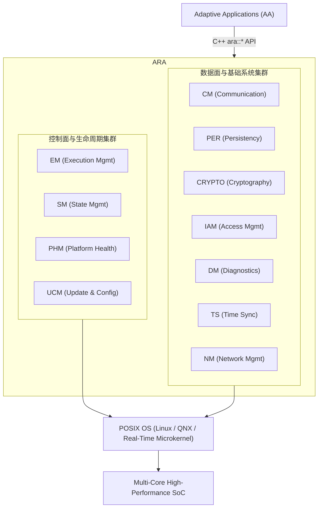
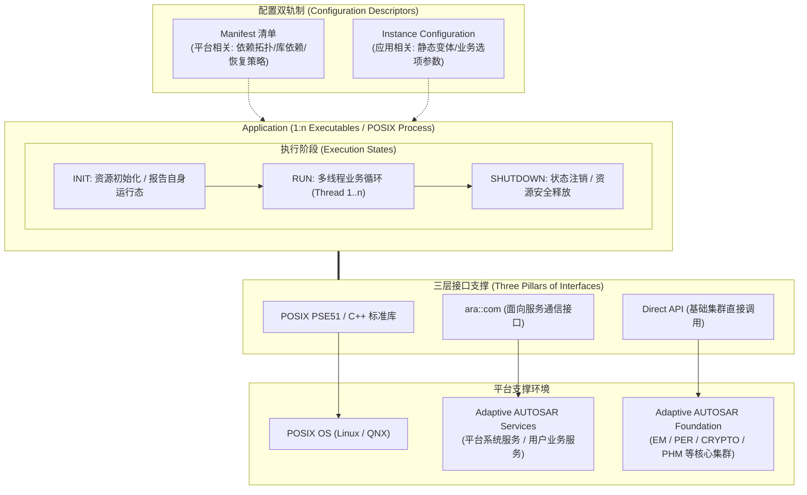
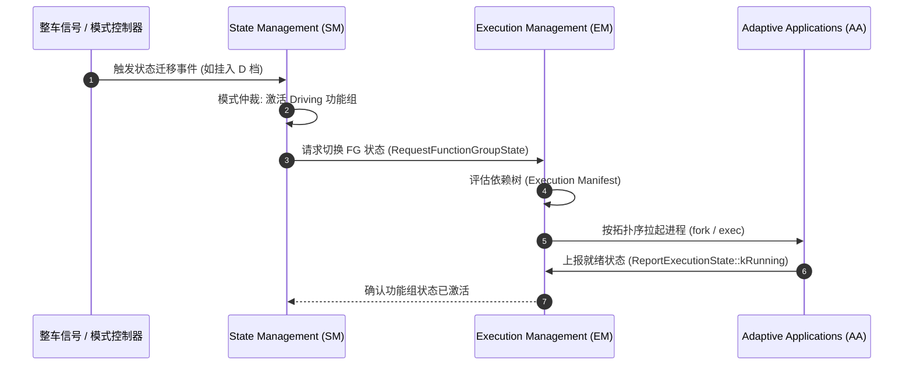
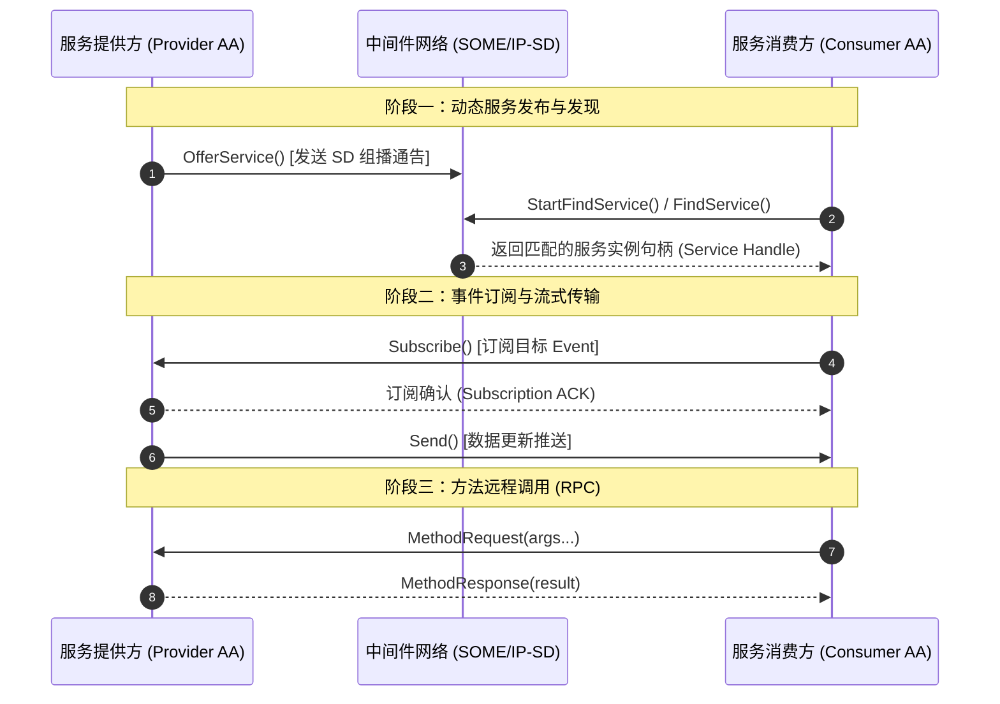
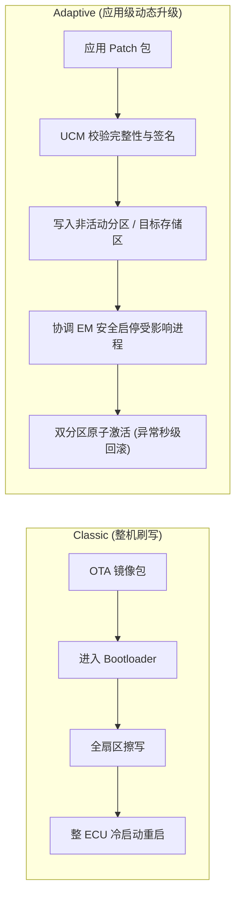
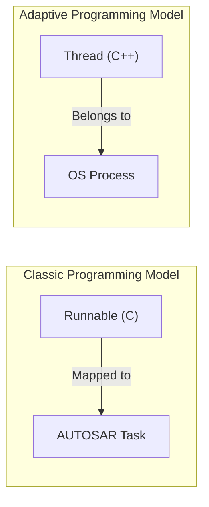
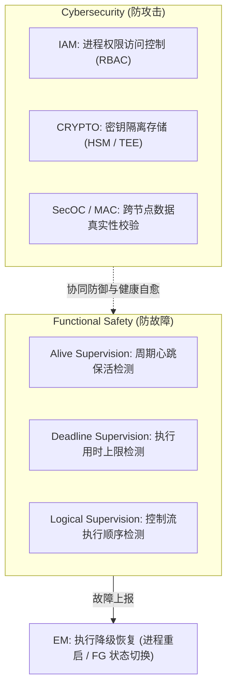
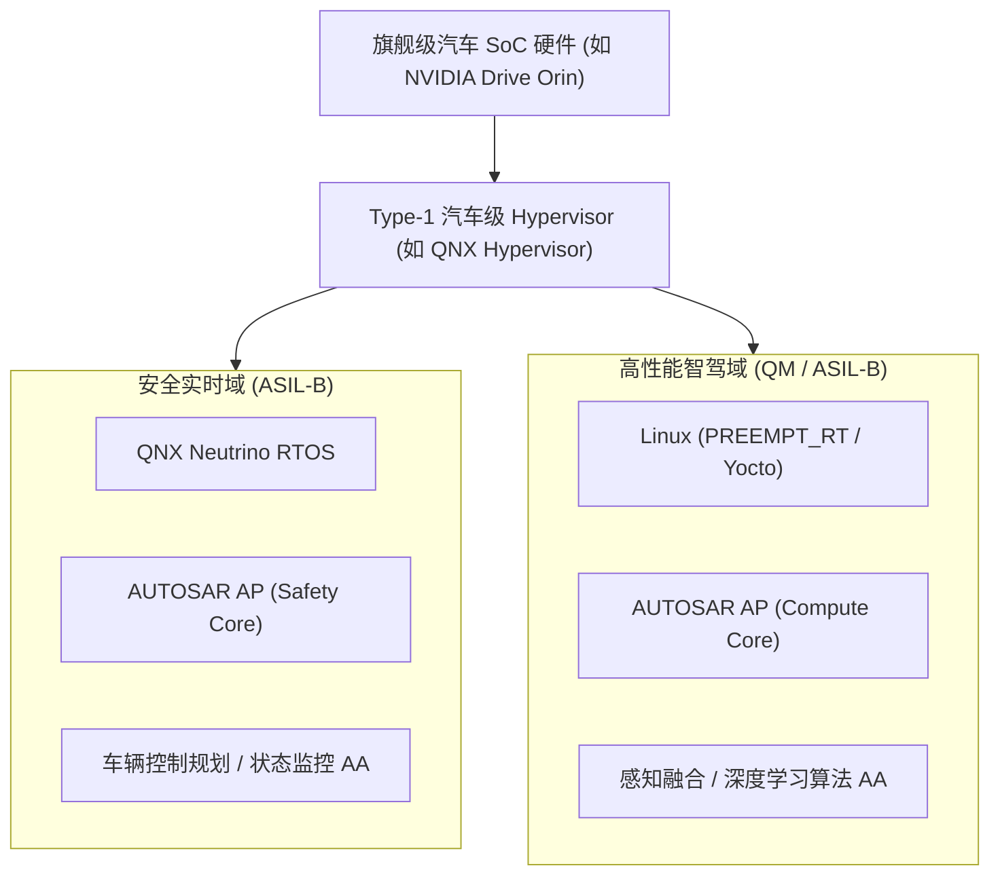

AUTOSAR 于 2017 年正式推出 Adaptive Platform（AP），以应对自动驾驶、智能座舱、车云互联和全车 OTA 等场景对高性能计算平台的需求。相比面向 MCU、强调静态配置的 [[autosar-classic|Classic Platform]]，Adaptive 运行在兼容 POSIX 标准的高性能操作系统（如 Linux、QNX）之上，原生支持现代 C++、多进程架构、面向服务通信（SOA）以及应用的动态部署与更新。

AP 与 CP 并非替代关系，而是分工协作：CP 专注于底层纳秒/微秒级硬实时控制与高安全完整性（ASIL D）；AP 则作为中央计算单元与域控制器的核心软件基座，处理海量数据吞吐与多核异构协同。两者通常通过 SOME/IP 等跨域协议进行通信协作。

AP 最大的特点是==运行时动态性==：服务可以动态注册与发现，应用可以独立部署与升级，进程具备故障隔离与自愈能力。深入理解执行管理（EM）、服务通信与发现（CM/SD）以及平台健康管理（PHM）等运行时控制机制，是掌握 Adaptive Platform 的关键。

## 1. CP 与 AP 的平台差异

两代平台的根本差异源于设计哲学中确定性与灵活性的权衡：
- **CP**：在系统集成与编译阶段静态固化所有 Task、通信拓扑及资源分配，系统启动后几乎不可更改，**强调行为的绝对可预测性与高硬实时性**
- **AP**：采用 POSIX 多进程与 SOA 架构，支持服务的动态注册与发现、应用的独立部署与按需加载，更贴近现代分布式与云原生软件工程范式

![[vector-autosar-comparison.png]]

### 核心维度对比

| 维度       | Classic Platform                   | Adaptive Platform                  |
| :------- | :--------------------------------- | :--------------------------------- |
| **目标硬件** | 实时 MCU（如 Infineon TC3xx、NXP S32K）  | 高性能异构 SoC（如 NVIDIA Orin、高通 8295）   |
| **操作系统** | 单地址空间 OSEK/VDX 实时 OS               | POSIX 标准 OS（Linux、QNX、VxWorks）     |
| **主要语言** | C（遵循 MISRA C 约束）                   | Modern C++（C++14/17 规范）            |
| **内存模型** | 编译期静态分配，禁用运行时动态内存                  | 严格受控的动态内存（内存池化、禁用缺页中断）             |
| **执行模型** | Task + Runnable                    | Process + Thread（独立地址空间与隔离保护）      |
| **通信机制** | Signal-based（Sender-Receiver 静态绑定） | Service-based（SOME/IP、DDS 动态发现与绑定） |
| **安全等级** | 最高可达 ASIL D                        | 通常定位于 ASIL B（高安全需求可剥离至独立安全核）       |
| **软件更新** | 整 ECU Bootloader 刷写                | 单应用 Package 动态安装/升级/回滚             |
| **设计目标** | 确定性与最高功能安全完整性                      | 灵活性、算力扩展性与持续演进能力                   |

## 2. Adaptive 架构与 ARA 功能集群

在 Classic Platform 中，应用软件组件 SWC 通过 RTE 屏蔽底层硬件与基础软件通信；而在 Adaptive Platform 中，所有上层自适应应用（Adaptive Application, AA）统一通过 **ARA（AUTOSAR Runtime for Adaptive Applications）** 访问平台能力。

ARA 为应用提供标准化的 C++ API 规范，其底层由一系列相互协作的功能集群（Functional Clusters, FC）支撑，构筑起车载计算平台的操作环境。



### 常见功能集群职责

| 功能集群                           | 模块缩写         | 核心工程职责                                         |
| :----------------------------- | :----------- | :--------------------------------------------- |
| **Execution Management**       | `EM`         | 平台启动入口，解析执行清单，管理进程生命周期、依赖拓扑与安全策略               |
| **State Management**           | `SM`         | 仲裁系统模式与整车上下文，协调功能组（Function Group）状态切换         |
| **Communication Management**   | `CM`         | 封装 SOME/IP、DDS 及 IPC 通信，提供面向服务的动态发现、RPC 与发布/订阅 |
| **Platform Health Management** | `PHM`        | 对进程的心跳活度、执行超时与执行逻辑进行监视，触发恢复策略                  |
| **Persistency**                | `PER`        | 提供键值（Key-Value）与文件存储，支持写安全机制与掉电一致性保护           |
| **Update & Config Management** | `UCM`        | 支持独立软件包的安装、校验、A/B 分区切换与异常快速回滚                  |
| **Cryptography / IAM**         | `CRYPTO/IAM` | 密钥生命周期管理（HSM/TEE 硬件加速）、报文验签加解密与应用访问控制鉴权        |
| **Diagnostics**                | `DM`         | 提供 UDS 与 DoIP（ISO 13400）车载诊断服务接口               |
| **Time Synchronization**       | `TS`         | 实现跨域与板内精确时钟同步（基于 IEEE 802.1AS / gPTP）          |
| **Network Management**         | `NM`         | 负责车载以太网节点的协同休眠与唤醒状态管理                          |

Adaptive Platform 采用模块化设计，可按需裁剪：

- 微内核最小系统：`EM` + `CM` + 目标业务应用（AA）
- 标准量产平台：`EM` + `SM` + `CM` + `PER` + `PHM`
- OTA/网联智能节点：增加 `UCM` + `CRYPTO` + `IAM`
- 高阶智驾中央计算平台：通常启用绝大部分功能集群，并引入时间同步（TS）与诊断（DM）

## 3. Adaptive Application

在 AUTOSAR AP 体系中，上层业务逻辑的最终承载单元是 Adaptive Application（AA）。它打破了传统 Classic Platform 中“编译期绑定的静态 Runnable”模型，转变为运行于操作系统之上的多线程独立 POSIX 进程，具备完整的生命周期状态机与标准化的三层分层接口。



### 进程实体与多线程执行模型

**1:n Executables 映射**：一个逻辑上的 Adaptive Application 可包含一个或多个可执行二进制文件（Executables）。每个 Executable 在系统加载时均实例化为一个独立的 **POSIX Process**，拥有专属虚拟地址空间与文件描述符，实现硬件级内存隔离。

**多线程并发（Multi-Threaded）**：进程内部广泛采用现代 C++14/17 线程库（`std::thread`）或 POSIX 线程（`pthread`）进行高并发分工，例如将通信监听、算法计算与看门狗心跳分别绑定至不同线程独立运行。

### 状态生命周期

AA 具备清晰的生命周期分期，并受 Execution Management（EM）的统一监控：

1. **INIT（初始化阶段）**：完成内存池与环形队列预分配、外设句柄获取，并通过 Execution Client 调用 `ReportExecutionState(kRunning)` 告知 EM 自身就绪；
2. **RUN（运行阶段）**：主业务多线程循环，处理传感器输入、对外发布/订阅 Event，或响应 RPC Method；
3. **SHUTDOWN（下电阶段）**：接收到 EM 的状态迁移指令或 OS 信号（SIGTERM）后，执行脏数据刷盘（Sync to PER）、注销服务并释放资源后安全退出。

### 三层接口体系

AA 与宿主环境的交互被严格收敛为三类标准化途径：

1. **POSIX PSE51 / C++ 标准库**：受限的 OS 级通用底层接口。AA 仅能使用 POSIX 实时安全子集（线程、互斥量、单调时钟等），由底层 POSIX OS（Linux/QNX）直接承载，严禁随意调用未经授权的系统特权调用；
2. **`ara::com` 接口**：统一的面向服务通信接口。无论 AA 访问的是平台级基础服务（如网关服务、诊断路由服务），还是其他 AA 提供的业务微服务，统一通过 `ara::com` 代理/骨架（Proxy/Skeleton）模式以 RPC、Event 或 Field 交互；
3. **Direct API（直接接口）**：专用于访问 **Adaptive AUTOSAR Foundation** 核心集群的 C++ 原生接口。应用直接调用静态/动态 API 与基础功能交互，典型如：
	- 向 `EM` 上报执行状态；
	- 调用 `PER` 存取 Key-Value 或读写标定文件；
	- 调用 `CRYPTO` 请求硬件加解密或验签；
	- 向 `PHM` 发送周期心跳检查点（Alive Checkpoint）。

### 配置双轨制：Manifest 与 Instance Configuration

AA 实现了软件逻辑与运行配置的完全解耦，依赖两套元数据描述文件：

- **Manifest（平台清单）**：面向底层基础设施与中间件。定义进程的二进制存储路径、启动参数、调度优先级（Nice/FIFO）、CPU 亲和性掩码（Affinity），以及当进程异常崩溃时的恢复动作（Recovery Action，如阈值内重启）。
- **Instance Configuration（实例配置）**：面向应用业务本身。提供应用实例的静态元数据与变体参数（如车辆高低配选项、特定国家的合规参数、相机/雷达标定矩阵路径等），由应用在启动时读取解析。

## 4. 执行管理 EM 与状态管理 SM

Adaptive 告别了单核中断循环与固定周期调度模式，采用“整车状态驱动，进程依赖编排”的执行体系：
- **Execution Management (EM)**：负责物理进程生命周期管理，扮演 ECU 级 `systemd` 的角色；
- **State Management (SM)**：负责逻辑系统状态管理，根据整车意图（Vehicle State）仲裁平台运行模式。

### Function Group（功能组）机制

为了有效编排复杂的多进程协作，AP 引入了 Function Group（FG）：一组具有强业务关联性、需要按相同状态节拍启停的应用进程集合。

常见的功能组定义：
- `MachineState`：管理整机系统状态（`Startup` → `Running` → `Shutdown` / `Restart`）；
- 业务级 FG（如 `Driving`、`Parking`、`Charging`）：将感知、融合、控制相关进程编组，进入对应驾驶模式时按需激活。



### 执行清单（Execution Manifest）的作用

每个 AA 在打包时均附带 ARXML 描述的执行清单，明确定义：
1. **可执行元数据**：程序路径、启动参数、环境变量；
2. **调度属性**：进程优先级、实时调度策略（`SCHED_FIFO` / `SCHED_RR`）、CPU 绑核掩码（Affinity）；
3. **依赖关系**：启动前必须就绪的先决服务（如 SensorDriver 先于 PerceptionApp 启动）；
4. **功能组映射**：进程在各 Function Group State 下的行为（启动、终止或挂起）。

## 5. 通信管理 CM 与 SOME/IP 服务

通信管理（`ara::com`）基于面向服务架构（Service-Oriented Architecture, SOA），屏蔽底层物理传输介质，向应用提供一致的服务契约。

### 统一服务模型

一个 AP 服务由三类元素组成：
1. **Method**：双向远程过程调用（RPC，带返回值）或单向调用（Fire-and-Forget），支持同步阻塞与 `std::future` 异步等待；
2. **Event**：发布/订阅（Pub/Sub）模式的数据广播流，支持队列深度配置与时间窗口过滤；
3. **Field**：具备当前状态值的属性，由 `Getter`、`Setter` 与更新通知 `Notifier` 组合而成。



### 通信开发范式（ara::com 示例）

```cpp
#include <ara/com/sample/radar_service_proxy.h>
#include <ara/core/promise.h>

// 1. 服务消费方检索目标服务句柄
auto handles = ara::com::sample::RadarServiceProxy::FindService();
if (!handles.empty()) {
    auto proxy = std::make_unique<ara::com::sample::RadarServiceProxy>(handles[0]);

    // 2. 订阅雷达点云数据事件 (设置接收队列深度为 10)
    proxy->TargetListEvent.Subscribe(10);
    proxy->TargetListEvent.SetReceiveHandler([&]() {
        proxy->TargetListEvent.GetNewSamples([](auto sampleToken) {
            ProcessRadarTarget(*sampleToken);
        });
    });

    // 3. 异步调用传感器标定方法 (RPC)
    auto future = proxy->CalibrateSensors(42);
    future.then([](auto result) {
        // 处理标定响应结果
    });
}
```

> **跨 ECU 与板内 IPC 绑定**：跨 ECU 通信通常绑定至 **SOME/IP** 或 **DDS**；而在同一 ECU 内部，现代 AP 栈底层会自动切换为基于共享内存（POSIX SHM）的零拷贝传输，应用代码保持透明统一。

## 6. 持久化 (PER) 与更新配置管理 (UCM)

### 持久化存储 (PER)

在 POSIX 操作系统环境下，传统 CP 的 `NvM → MemIf → Fee → Fls` 复杂存储链路被重构为基于文件系统的结构：
- **Key-Value Storage**：存储标定偏移量、用户偏好、网络配置等小体积结构化键值对；
- **File Storage**：直接持久化大体积文件（如高精地图切片、AI 推理模型权重）。
- **可靠性保障**：`ara::per` 内部提供写前日志（WAL）、双备份写及 CRC 校验机制，确保在意外断电场景下数据不损坏、不丢失。

### 更新与配置管理 (UCM)

UCM 是车载 OTA 的执行落地核心。与传统 CP 平台停机整包刷写 Flash 相比，AP 实现了应用级细粒度无感更新。



## 7. C++14/17 与 POSIX PSE51 编程约束

Adaptive 拥抱现代 C++ 开发生态，但在严苛的车规级安全约束下，绝非放任使用全部语言特性，而是受限于 **POSIX PSE51（单进程多线程实时安全子集）** 及 **AUTOSAR C++14 编码规范**。



### 关键约束与设计实践

1. **确定性内存管理**：
   - 生产环境中禁用运行期不可预测的动态内存申请（`malloc` / `new`），必须在初始化阶段完成内存池（Memory Pool）预分配；
   - 严格避免缺页异常（Page Fault）打乱确定性响应时间。
2. **受限的 POSIX 系统调用**：
   - **允许**：`pthread_create`、互斥锁、条件变量、高精度单调时钟（`CLOCK_MONOTONIC`）；
   - **禁止**：业务应用严禁调用 `fork()` / `exec()` 自行孵化子进程（由 EM 统一代理创建）；
   - **禁止**：禁止运行期未经授权动态加载外部未知共享库（`.so`）。
3. **语言特性权衡**：
   - 全面推广 **RAII**、智能指针与泛型编程；
   - **异常处理策略**：在安全关键型子系统（ASIL）中通常编译期彻底禁用 C++ 异常（采用 `ara::core::Result` 错误码机制代替），仅在 QM 级非关键服务中有条件允许异常。

## 8. 与 Classic Platform 的跨域集成

在集中式电子电气（E/E）架构演进过程中，AP 与 CP 将长期协同共存。AP 负责高算力计算，CP 负责底层敏捷执行，两者依赖跨域网关（Gateway）构建端到端通道。

```mermaid
flowchart LR
    subgraph ClassicECU["Classic 实时节点 (MCU)"]
        Sensor["传感器信号 (如轮速)"]
        CANStack["COM / PduR / CAN"]
        Sensor --> CANStack
    end

    subgraph CentralGateway["跨域网关单元 (Gateway)"]
        PduParser["PDU 解包与信号解析"]
        SignalMapper["Signal ↔ Service 协议转换"]
        TimeSync["时钟基准转换 (CAN ↔ gPTP)"]
        E2E["端到端安全校验 (E2E 转换/透传)"]
        
        PduParser --> SignalMapper
        SignalMapper --> TimeSync
        TimeSync --> E2E
    end

    subgraph AdaptiveSoC["Adaptive 计算节点 (SoC)"]
        SOMEIPStack["ara::com / SOME/IP 栈"]
        App["自动驾驶融合定位 AA"]
        SOMEIPStack --> App
    end

    CANStack -->|"CAN / CAN-FD 报文"| PduParser
    E2E -->|"SOME/IP 以太网帧"| SOMEIPStack
```



### 网关工程实践关键考量

1. **时延预算**：信号到服务的解包与序列化映射需严格控制在 **5 ~ 20 ms** 延迟预算之内；
2. **限流与抑制**：高频 CAN 信号进入 AP 端前需进行变化率过滤或合并打包，防止 SOME/IP 广播泛洪冲垮 AP 端的接收队列；
3. **时钟基准对齐**：跨域数据融合依赖一致的时间戳。网关需将底层局部时钟映射至 IEEE 802.1AS（gPTP）全车统一授时基准。

## 9. 信息安全 (Security) 与平台健康管理 (Safety)

引入以太网、动态进程与开放生态后，AP 必须同时防御来自外部的恶意攻击（Cybersecurity），并容忍系统内部的软硬件故障（Functional Safety）。



### 关键监控机制详解

- **IAM（身份与访问管理）**：在系统调用与通信服务层面实施访问控制。某进程若要在 `ara::com` 消费特定服务或读写敏感持久化区域，必须在 Manifest 中获得显式授予，杜绝提权渗透。
- **PHM（平台健康管理）的三层监控机制**：
  1. **Alive 监控**：在设定时间窗口内，检查应用心跳上报次数是否落在允许区间内；
  2. **Deadline 监控**：从检查点 A 到检查点 B 的耗时不能超过预设阈值（防卡死/防饥饿）；
  3. **Logical 监控**：代码逻辑执行路径必须完全匹配预设的状态转换图（防指针跳转错乱或控制流劫持）。

## 10. 典型量产部署与系统性能调优

在基于 NVIDIA Orin、高通 8295 等旗舰 SoC 的量产架构中，AP 通常运行在 Type-1 Hypervisor 隔离出的多虚拟机（VM）环境中，兼顾硬安全与高算力需求。



### 核心性能调优实践

| 调优维度 | 瓶颈根因 | 生产级优化手段 |
| :--- | :--- | :--- |
| **CPU 调度** | 进程跨核迁移引发 L1/L2 Cache 频繁失效 | 实施 **CPU 绑核（Affinity）**，将高实时 AA 独占指定 CPU 物理核心；配置 `SCHED_FIFO` 优先级 |
| **跨进程通信** | Socket/以太网栈内核上下文频繁切换 | 同板进程间全部采用基于 POSIX 共享内存的零拷贝（Zero-Copy）IPC 机制 |
| **内存访问** | 运行时动态申请内存导致的内存碎片与锁竞争 | 引导阶段预分配连续物理大页内存，统一由专属 BufferPool 管理，彻底消除缺页延迟 |
| **冷启动耗时** | 庞大二进制库加载与串行初始化 | 精简依赖拓扑树；在 EM Manifest 中实施非关键服务延迟加载（Lazy Start），并行化拉起独立无依赖节点 |
| **数据序列化** | 复杂动态数据结构深度序列化开销 | 关键通信结构体采用固定对齐内存布局（POD/FlatBuffers 思想），规避动态反射与深拷贝 |

## 总结

AUTOSAR Adaptive Platform 的本质，是将现代分布式系统的软件工程能力（服务化、组件解耦、动态部署、高并发）与严苛的车规级功能安全与信息安全要求深度结合的产物。

理解 AP 的关键，在于摆脱传统微控制器中“全局中断与轮询任务”的单体思维，转而以“状态机驱动生命周期、服务契约定义通信、进程沙箱保障安全”的现代系统架构视角，驾驭整车中央计算时代的系统设计与工程交付。
