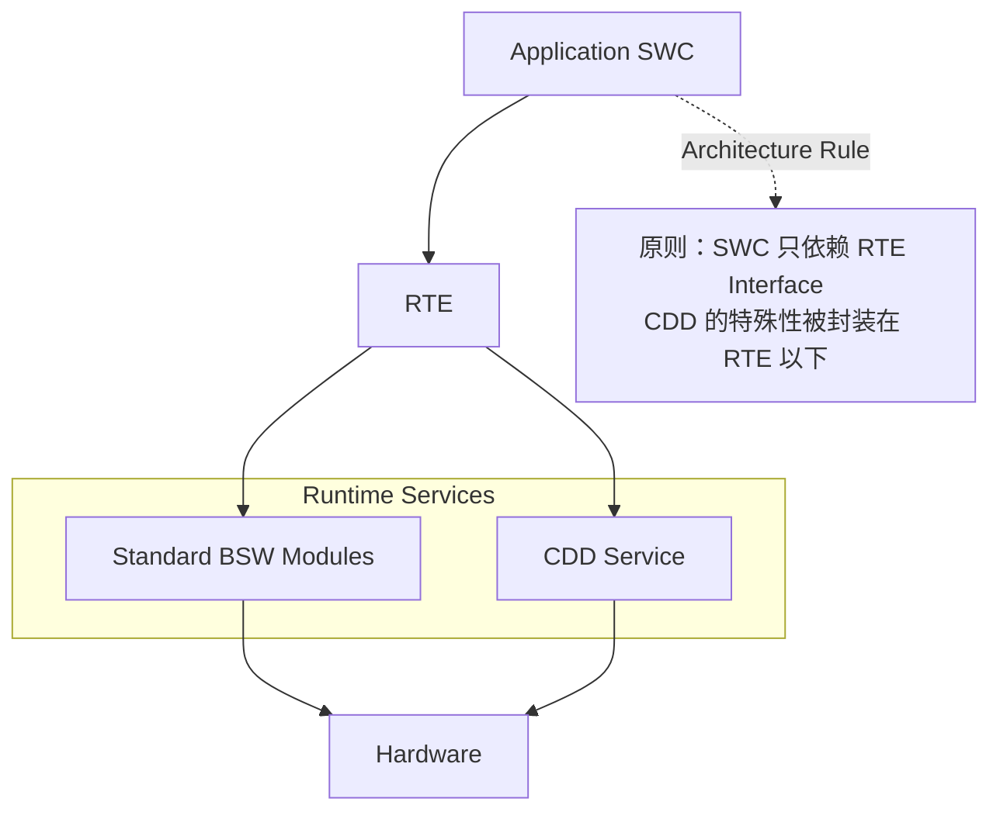
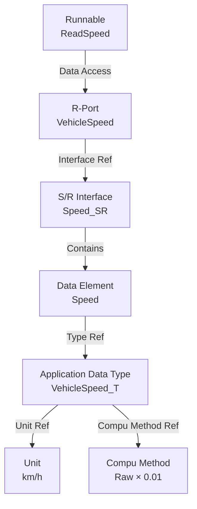
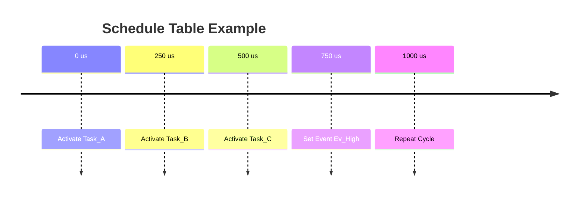

Classic 平台的“配置即代码（Configuration as Code）”范式初看繁琐，但换来的是高度的可复用性、可认证性和可追溯性。工程实践中的难点主要集中在三个方面：

1. **RTE 生成机制**：理解 Runnable 的触发时机、事件映射关系以及数据传递路径；
2. **OS 调度设计**：合理配置周期任务、优先级、Schedule Table、Timing Protection 等运行时行为；
3. **工具链协同**：不同厂商工具依赖 ARXML 交换模型和配置，版本兼容性与供应商扩展往往是项目中的主要风险来源。

## AUTOSAR Classic 分层架构

![[autosar-cp-layered.png]]

AUTOSAR Classic 的核心价值并非“分层”本身，而是通过标准化接口实现软硬件解耦。理论上，当 MCU 从 NXP S32K 迁移到 Infineon TC3xx 时，只需替换 MCAL 和相关配置，上层 SWC 与业务逻辑无需修改。代价是调用链长、开销大。

### CDD

复杂驱动（CDD）则是架构中的例外通道，它允许绕过部分标准软件栈直接访问硬件，以支持 AUTOSAR 标准尚未覆盖的特殊外设或性能敏感场景。因此 CDD 会削弱平台可移植性，在功能安全项目中通常需要进行额外的设计与认证论证。

CDD 是为了绕过标准软件栈访问硬件，而不是为了绕过 RTE 访问应用。所以推荐的交互方式是：CDD 提供 Port，上层 SWC 通过 RTE 访问。



## BSW 模块分类

| 组     | 代表模块                             | 职责          |
| ----- | -------------------------------- | ----------- |
| 系统服务  | [[OS]]、[[EcuM]]、[[BswM]]、WdgM    | 启动、模式管理、看门狗 |
| 通信服务  | [[Com]]、[[PduR]]、[[CanIf]]、CanTp | 信号打包、路由、传输层 |
| 诊断    | [[Dcm]]、[[Dem]]、FiM              | UDS 服务、故障管理 |
| 存储    | [[NvM]]、[[Fee]]、[[Ea]]、[[MemIf]] | 非易失存储抽象     |
| IO 抽象 | IoHwAb、Adc、Pwm、Dio               | 传感器/执行器抽象   |
| MCAL  | Can、Adc、Dio、Fls、Gpt              | 芯片驱动        |

启动序列是理解 BSW 的切入点：

```text
上电
  → EcuM 初始化 MCU 时钟、内存
  → 初始化 MCAL（Can、Adc...）
  → 初始化 MemIf → Fee → NvM（读持久化数据）
  → 初始化 Com → PduR → CanIf → Can（通信就绪）
  → 初始化 Dem、Dcm（诊断就绪）
  → BswM 进入 RUN 模式
  → RTE 启动 → SWC 的 Init Runnable 执行
  → OS 启动调度，周期任务开始
```

因此，当某个 Runnable 被调度执行时，其所依赖的驱动、通信、诊断、NVRAM 和模式管理能力实际上已经全部就绪。

## SWC 交互建模

AUTOSAR 应用层由多个 SWC 组成。SWC 可以理解为一个独立的软件功能单元，它封装内部算法与状态，仅通过标准化接口与外界交互。设计良好的 SWC 应具备以下特点：

- 不依赖具体 MCU 或 ECU 硬件
- 不直接访问寄存器或驱动
- 不感知通信网络（CAN/LIN/Ethernet）
- 所有交互均通过 Port 和 RTE 完成

因此，SWC 的核心工作并不是操作硬件，而是处理数据和实现业务逻辑。

```text
Port 类型：
  P-Port（Provide）：提供服务
  R-Port（Require）：请求服务

Interface 类型：
  Sender-Receiver（S/R）：数据传递，一对一/一对多
    - 有队列（队列长度可配）或无队列（覆盖）
    - 数据一致性：用 E2E 保护

  Client-Server（C/S）：函数调用
    - 同步或异步（异步返回用 callback）

Runnable：
  SWC 内可被调度的函数
  - Init Runnable：初始化，执行一次
  - Periodic Runnable：周期执行
  - Triggered Runnable：事件触发
  - Operation Runnable：响应 C/S 调用

示例（一个车速显示的 SWC）：
  R-Port：VehicleSpeed（S/R，来自 CAN）
  P-Port：DisplaySpeed（S/R，输出到仪表）
  Runnable：ReadSpeed（周期 20 ms）
```

AUTOSAR SWC 的设计目标是「可移植与可复用」。

> SWC 描述“做什么”，Port 描述“与谁交互”，Interface 描述“交换什么”，Runnable 描述“什么时候执行”，而 RTE 负责将这些模型映射为最终运行的代码。

## RTE 生成与通信机制

RTE 是 AUTOSAR Classic 最具代表性的设计之一。它位于 Application Layer 与 BSW 之间，为 SWC 提供统一的运行环境和通信接口。

RTE 本质上是一层自动生成的软件中间件。它不是手写的，而是由 RTE Generator 根据系统模型自动生成。

```text
RTE 生成器输入：
  SWC 描述（ARXML）：Port、Runnable、触发条件
  ECU 配置：SWC 到 ECU 的映射、任务映射
  通信矩阵：信号到 COM 的映射

RTE 生成器输出：
  Rte.c / Rte.h：通信 API
  Rte_<SWC>.c：SWC 的框架代码
  任务主体：把 Runnable 挂到 OS Task

RTE API 示例：
  /* 发送信号 */
  Rte_Write_DisplaySpeed_speed(value);

  /* 接收信号 */
  Rte_Read_VehicleSpeed_speed(&speed);

  /* C/S 调用 */
  Rte_Call_MyPort_MyOperation(arg, &result);
```

## ECU 配置与 ARXML

AUTOSAR 使用 ARXML（AUTOSAR XML） 作为统一的配置与模型交换格式。无论是 SWC、接口、通信、诊断、OS 还是 ECU 配置，最终都以 ARXML 的形式进行描述和交换。

下面是一个简化的 SWC 定义：

```xml
<APPLICATION-SW-COMPONENT-TYPE>
  <SHORT-NAME>SpeedDisplay</SHORT-NAME>

  <PORTS>
    <R-PORT-PROTOTYPE>
      <SHORT-NAME>VehicleSpeed</SHORT-NAME>
      <REQUIRED-INTERFACE-TREF>
        /Interfaces/Speed_SR
      </REQUIRED-INTERFACE-TREF>
    </R-PORT-PROTOTYPE>
  </PORTS>

  <INTERNAL-BEHAVIORS>
    <RUNNABLE-ENTITY>
      <SHORT-NAME>ReadSpeed</SHORT-NAME>
      <MINIMUM-START-INTERVAL>0.02</MINIMUM-START-INTERVAL>
    </RUNNABLE-ENTITY>
  </INTERNAL-BEHAVIORS>

</APPLICATION-SW-COMPONENT-TYPE>
```

这个片段描述了：

```text
SWC: SpeedDisplay
R-Port: VehicleSpeed
Interface: Speed_SR
Runnable: ReadSpeed
Minimum Start Interval: 20 ms
```

AUTOSAR 模型不是一棵树，而是一张引用网络。在 ARXML 中大量出现 `*_REF`，所以理解 AUTOSAR 的关键不是记 XML 标签，而是理解这些引用关系。




## OS 任务调度

AUTOSAR OS 基于 OSEK/VDX 标准，是一个面向汽车 ECU 的实时操作系统（RTOS）。与 Linux 或 Windows 不同，它强调确定性（Determinism）和静态配置（Static Configuration）。

最终，所有 SWC 的 Runnable 都会被映射到 OS Task，由 OS 统一调度执行。

```text
任务类型：
  基本任务（Basic Task）：无等待，跑完就绪队列切换
  扩展任务（Extended Task）：可等待事件（WaitEvent）
  两者混用需谨慎，扩展任务开销大

调度策略：
  完全抢占式（Full Preemptive）：高优先级立即抢占
  非抢占式（Non Preemptive）
  混合式：按任务配置

优先级：
  数字越大优先级越高
  资源（Resource）用优先级天花板协议防优先级反转

中断：
  Category 1：不经过 OS，最快，不调用 OS 服务
  Category 2：由 OS 管理，可调用 OS 服务

计数器（Counter）与警报（Alarm）：
  计数器记录 tick（如 1 ms）
  Alarm 监听 Counter
  警报在计数到达时触发任务或事件
  周期任务 = 用 Alarm 周期激活
```

任务划分原则：周期相近的 Runnable 合并到一个任务，减少任务切换开销；安全关键任务给高优先级。

## 调度表与时间保护

在 AUTOSAR OS 中，普通周期任务通常通过 Counter + Alarm 激活。而对于需要严格时间关系和确定性执行顺序的场景，则会使用 Schedule Table。

对于 ASIL 项目，仅能正确调度还不够，还需要确保任务不会超时、失控或异常占用资源，因此引入了 Timing Protection。

```text
调度表（Schedule Table）：
  定义一组「到期点（Expiry Point）」
  每个到期点激活特定任务或设置事件
  保证确定性执行顺序

  示例（1 ms 周期，4 个到期点）：
    T=0      → 激活 Task_10ms_A
    T=250us  → 激活 Task_10ms_B
    T=500us  → 激活 Task_1ms_C
    T=750us  → 设置事件 Ev_High

时间保护（Timing Protection，ASIL D 必需）：
  执行时间保护：任务执行超过预算 → 触发保护钩子
  到达率保护：任务激活过于频繁 → 触发保护
  锁时间保护：任务持锁超时 → 触发保护

  保护动作：终止任务、记录、进入安全状态

  配置示例：
    Task_Period = 10 ms
    ExecutionBudget = 2 ms
    TimeFrame = 10 ms  ← 到达率保护窗口
```

Schedule Table 将一组时间触发动作组织到同一个时间轴上。



Timing Protection 保证任务不会超时、过频或长期占用资源。

时间保护的配置需要结合 WCET 分析，预算太紧会误触发，太松则失去保护意义。

## MCAL 与硬件抽象

MCAL 是 AUTOSAR Classic 最靠近硬件的一层，也是整个分层架构实现可移植性的基础。它位于 ECU Abstraction Layer 之下，直接访问 MCU 寄存器和外设资源，并向上提供统一的标准接口。一般由芯片厂商提供并配置：

```text
主要 MCAL 模块：
  Can / CanIf     ：CAN 控制器驱动
  Adc             ：模数转换
  Dio             ：数字 IO
  Pwm             ：PWM 输出
  Gpt             ：通用定时器
  Fls / Fee       ：Flash 驱动 / Flash EEPROM 仿真
  Spi             ：SPI 通信
  Wdg             ：看门狗
  Mcu             ：时钟、复位、电源

配置方式：
  用芯片厂商的配置工具（如 Infineon AURIX 的 EB tresos）
  生成 Mcu_Cfg.c、Can_Cfg.c 等配置文件
  通过 ARXML 与其他 BSW 模块集成

多核（AURIX TC3xx 有 6 核）：
  每个核可跑独立 OS
  MCAL 支持多核，注意共享外设的核间同步
  核间通信（IOC）用 MCAL 的 Ipc 模块
```

MCAL 的配置与硬件强相关，是移植工作量的主要来源。

## 工具链与生成流程

AUTOSAR 工具链由多家厂商组成，通过 ARXML 协作：

```text
典型工具链组合：
  系统设计：SystemDesk / PREEvision / DaVinci Developer（Vector）
  ECU 配置：DaVinci Configurator / EB tresos
  MCAL 配置：芯片厂商工具
  OS 配置：DaVinci Configurator
  代码生成：各工具自带生成器
  编译：Tasking / GHS / IAR 编译器

生成流程：
  1. 系统设计工具产出系统 ARXML
  2. ECU 提取 → 单 ECU 配置 ARXML
  3. 导入 ECU 配置工具，配置 BSW
  4. 生成 BSW 代码 + RTE 代码
  5. 集成 SWC 代码（手写或 Simulink 生成）
  6. 编译链接 → 可执行文件
  7. 刷入 ECU，用 CANoe 验证

坑点：
  不同工具 ARXML 版本不一致
  配置项名称在各版本间会变
  生成代码不可手改（会被覆盖）
```

一个 ECU 的完整配置可能有几千个参数，配置管理（版本、diff、评审）是工程管理的重点。

## 工程决策

| 决策点         | 选项 A            | 选项 B           | 推荐原则                                             |
| ----------- | --------------- | -------------- | ------------------------------------------------ |
| 平台选择        | AUTOSAR Classic | 裸机 / 自研框架      | 涉及功能安全、诊断、OTA、大规模软件复用时优先 Classic；简单控制器可采用裸机方案    |
| S/R 通信      | Non-Queued      | Queued         | 状态量（车速、电压、温度）使用 Non-Queued；事件流（按键、事件通知）使用 Queued |
| C/S 通信      | 同步调用            | 异步调用           | 快速服务同步调用；耗时操作（Flash、复杂计算）优先异步                    |
| Runnable 映射 | 多 Task          | 少 Task         | 周期和实时性要求接近的 Runnable 合并到同一 Task，减少上下文切换          |
| Task 类型     | Basic Task      | Extended Task  | 默认优先 Basic Task，仅在需要 WaitEvent 时使用 Extended Task |
| 调度机制        | Alarm           | Schedule Table | 独立周期任务使用 Alarm；具有严格时序关系的控制链路使用 Schedule Table    |
| 调度策略        | Full Preemptive | Non-Preemptive | 安全关键、实时控制任务优先抢占式；后台任务可采用非抢占式                     |
| 时间保护        | 开启              | 关闭             | ASIL C/D 必须启用；QM 项目根据资源和实时性需求评估                  |
| 通信抽象        | 标准 BSW          | CDD            | 优先使用标准栈；仅在性能或特殊硬件无法满足时引入 CDD                     |
| 硬件访问        | 经 RTE           | 直接调用驱动         | SWC 应仅依赖 RTE；避免直接访问 MCAL 或寄存器                    |
| 配置维护        | 模型驱动            | 手工修改生成代码       | 修改 ARXML 和配置模型，不修改 Generated Code                |
| MCU 迁移      | 保持 SWC 不变       | 重构应用代码         | 将 MCU 相关逻辑限制在 MCAL、CDD 和配置层                      |

AUTOSAR Classic 的核心思想是「模型驱动 + 配置驱动」。

- SWC 负责业务功能
- Runnable 定义执行逻辑
- RTE 负责连接组件
- OS 决定何时执行
- BSW 提供系统服务
- MCAL 屏蔽硬件差异
- ARXML 承载系统模型
- 工具链负责将模型转换为最终代码

从工程角度看，AUTOSAR 的难点不在于编写代码，而在于理解模型、配置、调度与生成代码之间的关系。真正成熟的 AUTOSAR 工程师，往往花更多时间分析 ARXML、Task 映射和 BSW 配置，而不是编写业务逻辑本身。