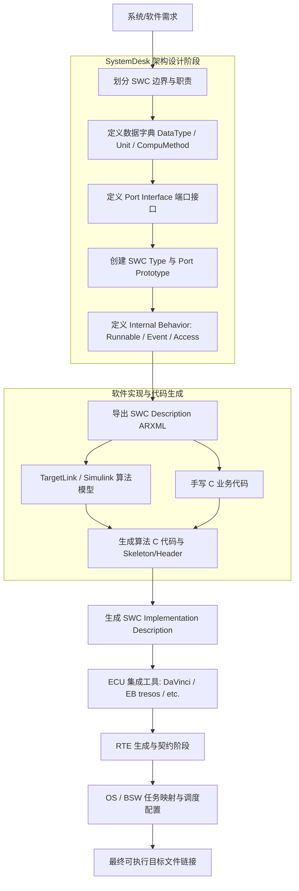

> 本指南主要面向基于 **dSPACE SystemDesk** 工具的 AUTOSAR Classic 软件组件建模实践。

dSPACE 官方将 SystemDesk 定位为 AUTOSAR 软件架构建模工具，用于创建 SWC、Composition、系统架构和 ECU 映射，并通过 ARXML 与其他工具交换 AUTOSAR 描述。在工程开发流中，SystemDesk 常与 TargetLink / Simulink 配合，完成 SWC 架构、算法模型、代码和 ARXML 之间的往返开发（Round-trip Engineering），或者作为手写代码的上层架构约束输出端。

## SWC 建模全景工作流

软件组件建模是 AUTOSAR V 流程系统设计向具体软件开发过渡的关键纽带。完整的开发闭环如下图所示：



## AUTOSAR 对象层次与 Package 规划

### 1. Package 的概念与规划原则

**Package** 是 AUTOSAR 对象的组织容器，相当于编程语言中的命名空间或文件系统的目录层级。合理的分包结构不仅便于在 SystemDesk 树状视图中检索，更有利于后续 ARXML 文件的模块化拆分、版本管理以及跨项目复用。

推荐的标准项目分包结构：

```text
/
├── ApplicationDataTypes      # 应用层物理数据类型
├── ImplementationDataTypes   # 基础平台与具体 C 语言实现类型
├── DataTypeMappingSets       # ADT 到 IDT 的类型映射集合
├── Units                     # 物理单位 (m/s, degC, etc.)
├── CompuMethods              # 物理值与原始值换算规则
├── PortInterfaces            # 端口接口定义 (S/R, C/S, Mode, etc.)
└── ComponentTypes            # SWC 类型与 Composition 定义
```

在 SystemDesk 中，右键点击 Package 即可创建各类 AUTOSAR 对象：

![[systemdesk-cp-objects.png]]

### 2. 核心 Component Type 辨析

- **Application SW Component Type**：最核心的应用软件组件类型，承载具体业务功能算法（如车速控制、电池管理、热管理、车身门控等），与底层硬件完全解耦
- **Composition SW Component Type**：SWC 的逻辑组合容器，内部包含多个 SWC 实例及其相互之间的内部连接和对外委托连接。如果现阶段仅负责交付某个单一功能 SWC，第一阶段可以不创建 Composition

## 第一步：数据字典建模

在定义任何接口之前，必须先建立严格的数据字典。AUTOSAR 4.x 将数据定义清晰地区分为 **应用层物理语义** 与 **底层实现语义** 两个世界。

```text
Application Data Type (0~300 km/h)
      │
      ├──> Compu Method (Raw * 0.01 = Physical)
      │         │
      │         └──> Unit (km/h)
      │
      ▼ 
Implementation Data Type (uint16, typedef)
```

### 三类核心数据定义

| 数据对象 | 核心职责 | 工程示例 |
|---|---|---|
| **Application Primitive Data Type (ADT)** | 描述物理含义与有效范围，不绑定具体编程语言数据格式 | `VehicleSpeed_T`: 物理范围 `0.0 ~ 300.0`，物理单位 `km/h` |
| **Implementation Data Type (IDT)** | 描述最终 C 代码和内存布局，决定变量的实际字节大小与符号性 | `uint16`, `float32`, `boolean`，对应基础标准类型头文件 |
| **Compu Method** | 描述底层原始数值（Raw/Internal Value）与工程物理值（Physical Value）之间的转换算式 | 原始值 `0 ~ 30000`，系数 `0.01`，偏移 `0`，换算为 `0.0 ~ 300.0 km/h` |
| **Unit** | 规范物理量单位，防止单位混淆 | `km/h`, `degC`, `rpm`, `V`, `A` |


## 第二步：端口与接口定义

### 1. 层次结构与关系总览

```text
SWC (Component Type)
 └─ Port Prototype (Rp... / Pp...)
      └─ Port Interface (S/R, C/S, Mode, etc.)
           └─ Data Element / Operation / Mode Declaration Group
                └─ Data Type (ADT / IDT)
```

- **Port Interface** 是抽象的契约模板（定义了传什么数据或提供什么操作）。
- **Port Prototype** 是 SWC 上的具体交互端口（实例化该契约，并指明方向：R-Port 或 P-Port）。

### 2. 常见 Interface 类型及其工程语义

#### Sender-Receiver Interface (S/R) - 数据流通信

应用层 SWC 最普遍的接口，用于周期性或事件驱动的数据流传递（如传感器读数、控制目标值、状态标记）。

- **组成**：包含一个或多个 `Data Element`。
- **传输模式**：
  - **Unqueued（默认，非队列）**：覆盖写入，接收端永远只能读取最新值，适合连续物理量。
  - **Queued（队列）**：FIFO 存储，保证每条数据不丢失，常用于事件通知或计数值。
- **初值 (Init Value)**：建议在 Data Element 或 Port 上指定 `InitValue`，避免系统上电未收到首帧数据时读出未初始化的垃圾值。
- **典型 RTE 代码**：
  ```c
  /* 接收端读取 (R-Port) */
  Std_ReturnType status = Rte_Read_RpVehicleSpeed_VehicleSpeed(&speed);

  /* 发送端输出 (P-Port) */
  Rte_Write_PpTorqueRequest_TorqueRequest(torque);
  ```

#### Client-Server Interface (C/S) - 服务请求与响应

用于函数式过程调用（RPC）。Client 端请求操作，Server 端响应并执行该操作。

- **组成**：包含一个或多个 `Operation`，每个 Operation 包含参数列表（`Argument`，方向为 `IN`、`OUT` 或 `INOUT`）以及可选的 `ApplicationError`（返回值）。
- **同步/异步**：
  - **同步调用**：Client 挂起等待 Server 执行完成返回。
  - **异步调用**：Client 发出请求后继续执行，后续通过 Poll 或 Callback 检查结果。
- **典型 RTE 代码**：
  ```c
  /* Client 端调用服务 (R-Port) */
  Std_ReturnType ret = Rte_Call_RpNvService_ReadData(blockId, buffer);
  ```

#### Mode Switch Interface - 模式切换通知

用于向 SWC 广播明确的系统/运行模式（如上下电管理、ECU 降级模式、网络管理状态）。

```text
VehicleModeDeclarationGroup
 ├─ STARTUP
 ├─ NORMAL
 ├─ DEGRADED
 └─ SHUTDOWN
```

> **架构设计准则**：严禁随意使用普通的 S/R 接口传输一个 `uint8` 枚举值来替代 Mode Switch。因为 AUTOSAR RTE 对 Mode Switch 有专门的生命周期语义，能够直接联动 **禁用或激活** 特定的 Runnable。

## 第三步：内部行为建模 (Internal Behavior) - SWC 的核心与灵魂

创建完 Ports，SWC 依然只是一个无业务逻辑的“黑盒外壳”。必须通过 **Internal Behavior** 为其赋予血肉。

```text
Internal Behavior
├── Runnables (可执行实体)
├── RTE Events (激活源)
├── Port Access Points (数据/服务访问权限)
│   ├── Data Read/Write Access (显式访问)
│   ├── Data Receive/Send Points (隐式访问)
│   └── Server Call Points (服务调用点)
├── Inter-Runnable Variables (IRV, 内部通信)
├── Per-Instance Memory (PIM, 内部私有存储)
└── Exclusive Areas (临界区互斥保护)
```

## 深度认知 Runnable

Runnable（可运行实体）是 **能够被 RTE 独立调度、启动的最小软件单元**。在 C 语言层面，每个 Runnable 最终映射为一个具体的 C 函数符号（`Symbol`）。

### Runnable 和 Port 的核心关系

初学者建模时常有一种误解：“给 SWC 创建了 Port，内部的 Runnable 就能自动收发数据”。实际上，**Port 只是 SWC 暴露给外部世界的通信端点，而 Runnable 是内部的代码执行入口**。两者之间的绑定关系必须在 `InternalBehavior` 中显式定义。

先看整体概念拓扑：

```text
Application SWC
│
├── Ports (对外暴露的通信门面)
│   ├── R-Port (需求端口: 输入信号 / 外部服务请求)
│   └── P-Port (提供端口: 输出信号 / 本地服务响应)
│
└── Internal Behavior (内部实现细节)
    ├── Runnables (执行实体)
    ├── RTE Events (激活触发源)
    ├── Data Access Points (变量读写访问点)
    └── Server Call Points (服务调用点)
```

> 💡 **核心原则**：Runnable 从不直接绑定“一整块 Port”，而是精准穿透绑定到 Port Interface 中定义的**具体 Data Element、Operation 或 Mode**。

在实际工程中，Runnable 与 Port 之间主要演化出以下**三种经典拓扑关系**：

```text
关系一 (数据流动):  Runnable ──[Data Access: Read/Write]──> S/R Port (Rp / Pp)
关系二 (发起调用):  Runnable ──[Server Call Point]─────────> C/S R-Port
关系三 (被动响应):  C/S P-Port ─[OperationInvokedEvent]────> Server Runnable
```

#### 1. 数据交互关系：通过 Data Access 关联 Sender-Receiver Port

- **场景角色**：Runnable 作为数据的**消费者**（读取输入）或**生产者**（发布输出）。
- **绑定载体**：Runnable 的 `Data Access`（在 SystemDesk 中对应 Data Read/Write Access 页签）。
- **架构流向**：

```text
[R-Port: RpVehicleSpeed] (Interface: VehicleSpeed_I)
        └── Data Element: VehicleSpeed
                  ▲
                  │ 关联配置 (Read Access)
       [Runnable: Control_10ms]
                  │ 关联配置 (Write Access)
                  ▼
[P-Port: PpTorqueRequest] (Interface: Torque_I)
        └── Data Element: TorqueRequest
```

- **代码与 RTE 影响**：
  RTE Generator 会严格根据 Data Access 声明，为该 Runnable 所在的源文件生成专有的读写宏或函数接口。未显式声明 Access 的数据元素，在代码中无法调用对应的 RTE API：

```c
/* 读取关联的 R-Port 数据元素 */
Std_ReturnType ret = Rte_Read_RpVehicleSpeed_VehicleSpeed(&vehicleSpeed);

/* 写入计算结果至关联的 P-Port 数据元素 */
(void)Rte_Write_PpTorqueRequest_TorqueRequest(targetTorque);
```

#### 2. 服务发起关系：通过 Server Call Point 关联 Client R-Port

- **场景角色**：Runnable 作为 **Client 端**，在执行业务逻辑时主动请求外部构件/BSW 提供的功能服务（例如读取 NvM 存储块、请求诊断服务、触发硬件执行机构）。
- **绑定载体**：Runnable 的 `Server Call Points`（SystemDesk 中对应 Operations/Server Call Points 页签）。
- **架构流向**：

```text
[Runnable: App_SaveData] (扮演 Client)
         │
         ▼ 声明 Server Call Point
[R-Port: RpNvMService] (Client-Server Interface)
         └── Operation: ReadBlock(...)
                  │ (跨 SWC / 跨层 RPC 调用)
                  ▼
              RTE 路由分发
```

- **代码与 RTE 影响**：
  RTE Generator 会生成阻塞等待的同步调用接口（Synchronous）或带轮询/通知机制的异步调用接口（Asynchronous）：

```c
/* 当前 Runnable 主动发起服务调用 (Client 角色) */
Std_ReturnType status = Rte_Call_RpNvMService_ReadBlock(BLOCK_ID, dataBuffer);
```

#### 3. 服务响应关系：通过 OperationInvokedEvent 关联 Server P-Port

- **场景角色**：Runnable 作为 **Server 端**，本身不主动执行，而是被动等待外部 Client 调用本 SWC 提供的服务。
- **绑定载体**：**RTE Events 体系中的 `OperationInvokedEvent`**。
- **架构流向**：

```text
外部 Client 发起调用请求
         │
         ▼
[P-Port: PpDid5005] (Client-Server Interface)
         └── Operation: ReadData(...)
                  │
                  ▼ 触发对应的事件
         [OperationInvokedEvent]
                  │ 激活绑定的服务端函数
                  ▼
[Server Runnable: UDS_Did_5005_ReadData]
```

- **关键辨析**：
  Server Runnable 与 P-Port 的关联**并不配置在 Data Access 页签**，而是通过 **Triggered by (激活源)** 绑定到 `OperationInvokedEvent`。
  当外部调用到达该 P-Port 的对应 Operation 时，RTE 拦截到该调用，并直接触发对应的 Server Runnable 执行，最后将处理结果返回给 Client。

#### 快速决策速查

| 交互诉求 | 涉及端口 | 关联机制 (在 SystemDesk 中的配置位置) | 典型生成的 RTE 语义 |
|---|---|---|---|
| **获取外界输入信号** | S/R R-Port | Runnable $\rightarrow$ `Data Access` $\rightarrow$ `Read Access` | `Rte_Read_<Port>_<Element>()` |
| **向外界发布计算结果** | S/R P-Port | Runnable $\rightarrow$ `Data Access` $\rightarrow$ `Write Access` | `Rte_Write_<Port>_<Element>()` |
| **主动请求外部功能/服务** | C/S R-Port | Runnable $\rightarrow$ `Operations` (Server Call Points) | `Rte_Call_<Port>_<Operation>()` |
| **承接并执行外部发来的操作** | C/S P-Port | InternalBehavior $\rightarrow$ `RTE Events` (`OperationInvokedEvent`) $\rightarrow$ 绑定此 Runnable | 被调用入口：`Runnable_Symbol(...)` |

### Runnable 与普通 C 函数的本质区别

```text
SWC
├── AUTOSAR RTE 暴露层 (在 ARXML 中声明)
│   ├── Runnable: Temperature_Init
│   └── Runnable: Temperature_10ms
│
└── C 内部私有实现层 (仅在 .c 内部，无需在 ARXML 建模)
    ├── FilterSensorNoise()
    ├── CheckBoundaryLimits()
    ├── LinearInterpolation()
    └── FloatToFixed()
```

| 维度 | AUTOSAR Runnable | 普通 C 函数 / Helper Function |
|---|---|---|
| **调度入口** | 由 RTE Event 激活，可直接映射到 OS Task | 由内部代码直接调用，不被 RTE 感知 |
| **ARXML 声明** | 必须有 `RUNNABLE-ENTITY` 元素与配置 | 无需在 ARXML 中体现 |
| **端口数据访问** | 需配置 Access Point 才能使用 `Rte_Read/Write` | 只能通过入参或全局变量传递数据 |
| **系统开销** | 占用 RTE 调度上下文与栈开销 | 普通栈帧调用，开销极低 |

### Runnable 划分黄金法则：粒度决策准则

> ⚠️ **核心工程陷阱**：严禁把软件中的每一个子函数都建模成一个 Runnable！这会导致 RTE 运行时开销、OS 任务切换和上下文保存成本极度膨胀。

在决定是否为一个功能新建 Runnable 时，只需问一个核心问题：

> **“这个函数是否需要拥有独立的 AUTOSAR 执行语义？”**

所谓**独立执行语义**，包括且仅包括以下条件（满足其一即可考虑）：

1. **独立触发源或执行周期**：例如 10ms 周期执行 vs 100ms 周期执行 vs 硬件中断/事件异步唤醒。
2. **独立服务入口**：作为 Server 响应外部 Client-Server Operation 请求（通过 `OperationInvokedEvent` 激活）。
3. **独立模式响应**：在特定模式进入（Entry）或退出（Exit）时单独激活/挂起。
4. **独立 Task 映射需求**：该功能属于高优先级核心控制回路，需要独占分配到高优先级 OS Task。
5. **独立并发与互斥控制**：具有特殊的并发（`canBeInvokedConcurrently`）或临界区隔离需求。
6. **独立的数据一致性边界**：需要 RTE 在执行前后统一进行全局数据快照（Copy-in/Copy-out）。

如果一个函数仅仅是为了**拆分代码长短、算法分步、提高复用性或改善可读性**，它只是**普通私有函数**，不能建模为 Runnable。

### RTE Events：何时激活 Runnable

Event 决定了 Runnable 在什么时刻、由谁来触发运行：

| Event 类型 | 典型应用场景 | 对应的 Runnable 角色 |
|---|---|---|
| **TimingEvent** | 1ms、5ms、10ms、100ms 等固定周期控制任务 | 周期算法主函数（如 `Ec_MainFunction`） |
| **InitEvent** | 上电或模块复位后的单次初始化逻辑 | 初始化函数（如 `Ec_Init`） |
| **DataReceivedEvent** | 当指定的 R-Port 收到新数据时立即激活 | 事件驱动型接收处理函数 |
| **OperationInvokedEvent** | 外部 Client 调用了本 SWC 提供的 Server 接口 | Server 端处理函数（如 `Uds_ReadData_Op`） |
| **ModeSwitchEvent** | 系统切换到特定模式（On Entry / On Exit）时触发 | 模式切换处理函数（如 `OnEnter_Sleep`） |
| **BackgroundEvent** | 系统空闲时运行 | 低优先级后台巡检或自检任务 |

Event 需要先在该 SWC Internal Behavior 的 RTE Events 中配置。

![[systemdesk-rte-events.png]]

### Data Access 访问模式深度对比：显式 vs 隐式

在 SystemDesk 中为 Runnable 关联端口数据时，必须理解 RTE 生成的两种截然不同的数据访问语义：

#### 显式数据访问 (Explicit Data Access)

- **配置项**：`Data Read Access` / `Data Write Access`
- **生成 API**：`Rte_Read_<Port>_<Element>()` / `Rte_Write_<Port>_<Element>()`
- **运行机制**：在 Runnable 执行体内部实时调用 API 访问 RTE Buffer。
- **特点**：如果同一个 Runnable 内调用了两次 `Rte_Read`，中间可能由于高优先级任务抢占修改了 Buffer，导致两次读取的值不同。适合对数据实时性敏感、内存占用极度受限的场景。

#### 隐式数据访问 (Implicit Data Access)

- **配置项**：`Data Receive Point By Value` / `Data Send Point`
- **生成 API / 访问方式**：`Rte_IRead_<re>_<p>_<o>()` / `Rte_IWrite_<re>_<p>_<o>()`
- **运行机制**：**Copy-in / Copy-out** 机制。在 Runnable 启动前，RTE 一次性将数据拷贝至局部副本；Runnable 结束时，一次性将输出刷新到外部。
- **特点**：确保在 Runnable 的整个执行周期内，数据完全一致且绝对防撕裂，但会增加局部内存拷贝开销。Simulink / TargetLink 模型导入时常用此类访问。

### Server Call Point：如何调用外部服务

当 Runnable 需要作为 Client 主动请求外部操作时，需要在 Runnable 下建立 **Server Call Point**：

```text
Runnable
 └─ Server Call Points
      └─ RpNvMService.ReadBlock (引用 R-Port 及其具体 Operation)
```

- **同步调用 (Synchronous)**：配置为 Synchronous 时，生成 `Rte_Call_<Port>_<Op>()`，调用会一直阻塞等待服务端返回。
- **异步调用 (Asynchronous)**：生成 `Rte_Call` 发起调用，并在后续通过 `Rte_Result` 查询处理结果。

### 组件内部机制：IRV、PIM 与 Exclusive Area

除了对外接口，Internal Behavior 还承担内部状态与线程安全管理：

- **Inter-Runnable Variable (IRV)**：同一个 SWC 内部不同 Runnable 之间通信的专用数据通路（不通过 Port，避免暴露给外部）。支持 Implicit 与 Explicit 访问。
- **Per-Instance Memory (PIM)**：用于存储组件实例级别的私有静态数据（类似 C++ 类的 private member 变量），支持多实例 SWC 独立分配内存。
- **Exclusive Area (临界区)**：用于保护并发访问的共享资源（如全局变量、硬件缓冲区）。通过配置 Runnable 进入/退出 Exclusive Area，RTE 将自动生成关中断或互斥锁代码（`Rte_Enter_...()` / `Rte_Exit_...()`）。

## 第四步：实现描述

SWC 建模完成内部行为后，如果需要将模型交接给具体代码实现或编译器，需要创建 **SwcImplementation**。

```text
ApplicationSwComponentType 声明架构与接口
        │
        ▼ describes architecture
SwcInternalBehavior 声明调度事件、数据访问与执行入口
        │
        ▼ implemented by
SwcImplementation 声明编译属性、代码依赖与源码交接
        │
        ▼ maps to
C Source Code (*.c) / Headers (*.h) / Object / Library
```

- **Code Descriptors**：指定生成的源文件、静态库路径或交付产物名。
- **Resource Consumption**：描述该实现的内存段分布（Memory Section，如 `.text`, `.bss`）与执行时间预算。
- **交接提示**：若前期仅做纯架构接口定义，把 ARXML 交由算法团队（如 Matlab/TargetLink）去生成算法代码，可在算法模型定型生成代码后再行补全 SwcImplementation。

## 工程实战案例

### 案例：`TemperatureMonitor`

#### 1. 功能需求

- 周期 10 ms 采样温度数据。
- 上电时复位报警状态。
- 如果温度高于报警阈值（$100^\circ\text{C}$），输出 `OverTemperature = TRUE`，否则输出 `FALSE`。

#### 2. 对象建模结构树

```text
DataTypes
 ├─ Temperature_T (ADT, 0~150 degC) --> uint16 (IDT)
 └─ Boolean_T (ADT) --> boolean (IDT)

PortInterfaces
 ├─ Temperature_I (Sender-Receiver)
 │    └─ Temperature: Temperature_T
 └─ OverTemperature_I (Sender-Receiver)
      └─ OverTemperature: Boolean_T

ComponentTypes
 └─ TemperatureMonitor (ApplicationSwComponentType)
      ├─ R-Port: RpTemperature (Interface: Temperature_I)
      ├─ P-Port: PpOverTemperature (Interface: OverTemperature_I)
      └─ SwcInternalBehavior
           ├─ Runnable: TemperatureMonitor_Init (Symbol: TemperatureMonitor_Init)
           │    └─ Triggered by: InitEvent
           │
           └─ Runnable: TemperatureMonitor_10ms (Symbol: TemperatureMonitor_10ms)
                ├─ Triggered by: TimingEvent_10ms (Period: 0.01 s)
                ├─ Data Read Access: RpTemperature.Temperature
                └─ Data Write Access: PpOverTemperature.OverTemperature
```

#### 3. 期望生成的 C 代码框架

```c
#include "Rte_TemperatureMonitor.h"

#define TEMPERATURE_LIMIT (10000U) /* 100.00 degC (CompuMethod Factor = 0.01) */

void TemperatureMonitor_Init(void)
{
    /* 上电初值输出 */
    (void)Rte_Write_PpOverTemperature_OverTemperature(FALSE);
}

void TemperatureMonitor_10ms(void)
{
    Temperature_T temperature = 0U;
    Boolean_T overTempFlag = FALSE;
    Std_ReturnType ret;

    /* 1. 显式读取环境温度 */
    ret = Rte_Read_RpTemperature_Temperature(&temperature);
    if (ret == RTE_E_OK)
    {
        /* 2. 执行逻辑判断 */
        if (temperature > TEMPERATURE_LIMIT)
        {
            overTempFlag = TRUE;
        }
        else
        {
            overTempFlag = FALSE;
        }

        /* 3. 显式输出超温状态 */
        (void)Rte_Write_PpOverTemperature_OverTemperature(overTempFlag);
    }
}
```

### 案例：`EcControl`

在复杂的控制器中，一个 MainFunction 通常同时汇聚多路数据输入、算法决断、调用底层执行器驱动服务并反馈状态。

#### 1. SystemDesk 建模界面实操参考

下图展示了在 SystemDesk 中为 `Ec_MainFunction` 配置各项 `Data Read Access` 与 `Data Write Access` 的典型设置视图：

![[systemdesk-ec-main.png]]

下图展示了该 Runnable 绑定的触发事件 `TimingEvent_10ms` 以及调用的底层驱动服务 `Server Call Points`：

![[systemdesk-ec-main-ops.png]]

#### 2. 标准架构拓扑设计

```text
Runnable: Ec_MainFunction
│
├── Triggered by
│   └── TimingEvent_10ms (周期 10ms 触发)
│
├── Data Read Access (输入信号流)
│   ├── RpMirrorState.MirrorState          # 后视镜物理位置状态
│   ├── RpLightSensor.LightLux             # 光照传感器照度输入
│   ├── RpHmiSetting.HmiSetting            # 用户屏幕开启/关闭设置
│   ├── RpAllowEcControl.AllowEcControl    # 外部总线允许控制标志
│   └── RpVehicleInfo.VehicleInfo          # 车辆挡位与车速信息
│
├── Server Call Points (底层服务驱动调用)
│   ├── RpEcDrive.GetEcTargetDuty          # 获取目标占空比计算服务
│   └── RpEcDrive.SetEcPwmDuty             # 下发执行器 PWM 控制服务
│
└── Data Write Access (状态输出流)
    └── PpAutoDimStatus.AutoDimStatus      # 输出当前防眩目激活与暗化状态
```

## 标准化命名规范速查表

在跨团队与跨工具链（SystemDesk $\rightarrow$ TargetLink $\rightarrow$ DaVinci）协作中，严谨的命名规范是保障自动化脚本和代码一致性的第一道屏障：

| 对象分类 | 命名模板 | 实例 | 说明 |
|---|---|---|---|
| **SWC Type** | `<Module>_<Function>_Swc` | `ThermalControl_Swc`, `ChassisCoordinator_Swc` | 明确功能语义，带 `_Swc` 后缀区分类型 |
| **R-Port** | `Rp<DataOrService>` | `RpVehicleSpeed`, `RpNvMService` | `Rp` 前缀表示 Required 端口 |
| **P-Port** | `Pp<DataOrService>` | `PpTorqueRequest`, `PpAutoDimStatus` | `Pp` 前缀表示 Provided 端口 |
| **PR-Port** | `Prp<DataOrService>` | `PrpVehicleMode` | 提供且接收的双向端口 |
| **S/R Interface** | `<DataName>_I` 或 `<DataName>_SR_I` | `VehicleSpeed_I`, `MotorTemperature_SR_I` | `_I` 结尾标明接口 |
| **C/S Interface** | `<ServiceName>_CSI` | `NvMService_CSI`, `EcDrive_CSI` | `_CSI` 标明 Client-Server 接口 |
| **Data Element** | `<PascalCase>` | `VehicleSpeed`, `MotorTemperature` | 大驼峰，准确表达物理量业务名 |
| **Operation** | `<Verb><Object>` | `ReadBlock`, `SetEcPwmDuty` | 动宾结构表达执行动作 |
| **Runnable** | `<Module>_<Period/Event>` | `Ec_MainFunction_10ms`, `Ec_Init`, `Uds_ReadData_Op` | 包含模块名与触发源/执行周期 |
| **RTE Event** | `TE_<Runnable>_<Period>` / `OIE_...` | `TE_Ec_MainFunction_10ms`, `OIE_ReadBlock` | 前缀标明 Timing/Operation 类型 |


## SystemDesk 建模避坑 Checklist

在完成 SWC 建模并准备导出 ARXML 前，逐一核对以下 10 条检查项，可规避 90% 以上的后续 RTE 生成报错：

- [ ] **1. ADT-IDT 映射完整性**：所有用到的 `ApplicationDataType` 是否已在 `DataTypeMappingSet` 中映射到有效的 `ImplementationDataType`？
- [ ] **2. Runnable Symbol 合法性**：每个 Runnable 的 `Symbol` 是否已填入合法的 C 函数名？（不能有特殊字符，不能与 C 语言关键字重名）。
- [ ] **3. Event 绑定唯一性与有效性**：周期性 Runnable 是否已绑定 `TimingEvent`？周期单位是否正确（秒 `s` vs 毫秒 `ms`，SystemDesk 默认单位为秒 `0.01` 表示 10ms）？
- [ ] **4. Server Runnable 触发方式**：提供服务的 Server 端 Runnable 是否正确绑定了 `OperationInvokedEvent`，而不是误配成了 TimingEvent？
- [ ] **5. Data Access 显式声明**：C 代码中需要调用 `Rte_Read` 或 `Rte_Write` 的信号，是否在 Runnable 的 Data Access 页面中建立了勾选映射？（未声明直接调用会导致 RTE 报未定义符号错误）。
- [ ] **6. 接口初值 (InitValue)**：S/R 接口的 Data Element 是否在接口或 Port 上配置了初始值，防止车辆刚上电时读出未定义数值？
- [ ] **7. 避免滥用 Runnable**：内部辅助算法函数是否已被排除在 Runnable 之外？SWC 的 Runnable 数量是否已做到尽可能收敛精简？
- [ ] **8. 区分 Explicit 与 Implicit**：确定是否需要 Copy-in/Copy-out 一致性保护？若无需一致性保护，优先使用 Explicit Access 以减少内存副本拷贝开销。
- [ ] **9. 内部共享变量安全性**：同一个 SWC 内部被多个 Runnable 访问的共享全局变量，是否配置为了 `Inter-Runnable Variable (IRV)` 或在 `Exclusive Area` 中保护？
- [ ] **10. Package 层次整洁**：导出的 ARXML 是否按照约定的分包路径存放，没有杂乱无章散落在 Root Package 下？